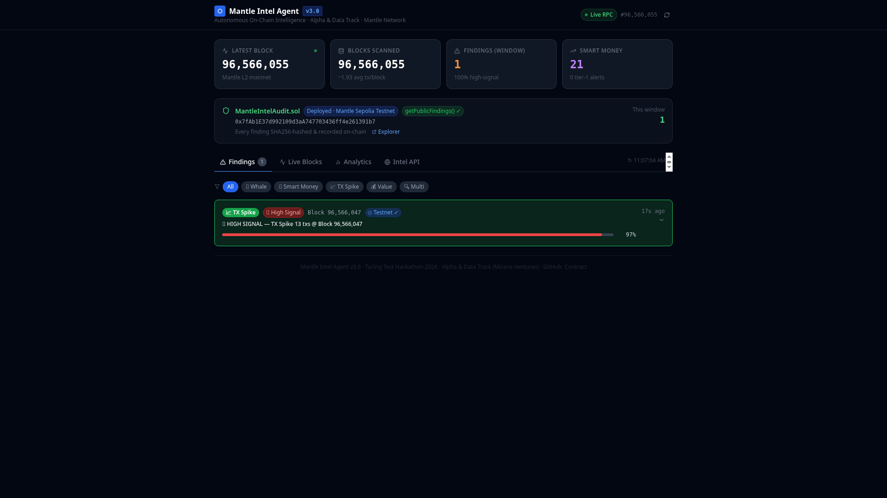
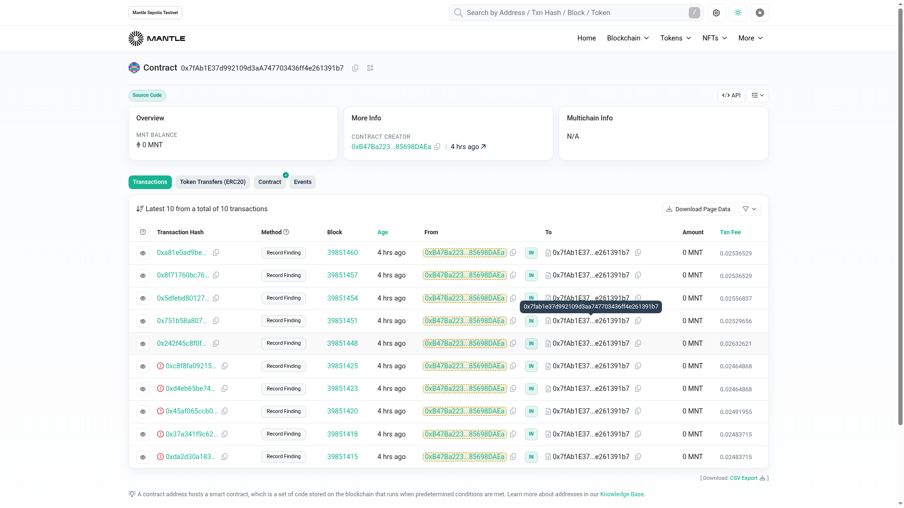
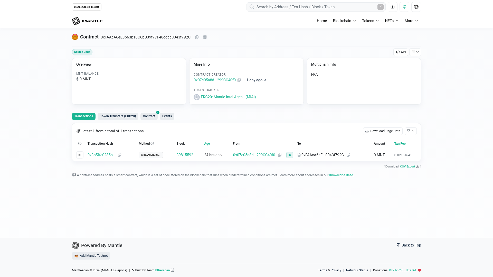
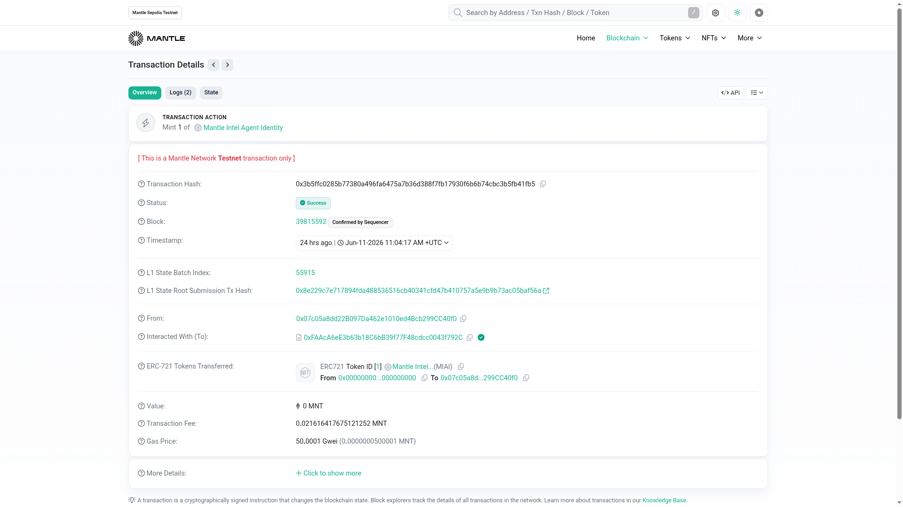
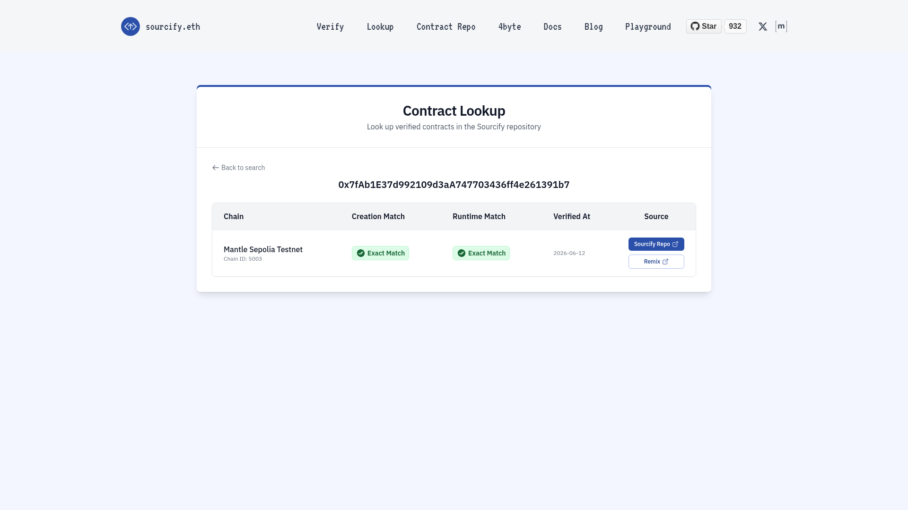
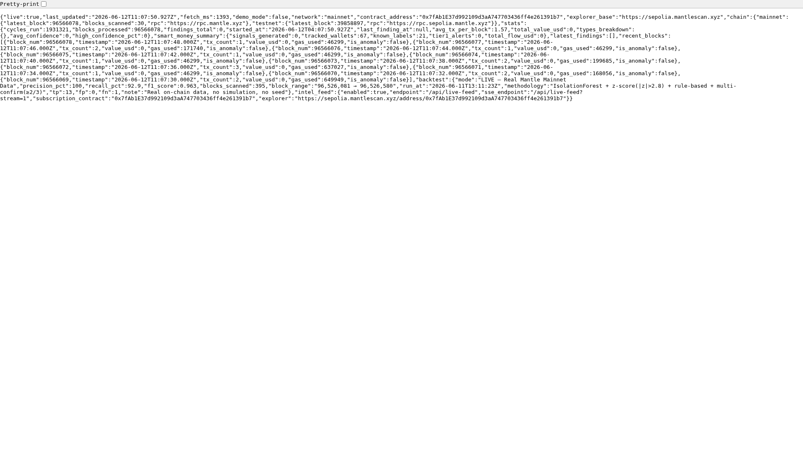

# Mantle Intel Agent

[](https://mantle-intel-agent.vercel.app)
[](https://sepolia.mantlescan.xyz/address/0x7fAb1E37d992109d3aA747703436ff4e261391b7)
[](https://dorahacks.io)

> Autonomous 5-agent AI pipeline for on-chain intelligence on Mantle Network.
> Every finding is SHA256-hashed and verified on Mantle L2.

---

## Demo Video

[](https://youtu.be/yPErNZW2hR0)

> **[▶ Watch on YouTube](https://youtu.be/yPErNZW2hR0)** — Full walkthrough: live anomaly detection, on-chain findings, backtest, dashboard, ERC-8004 NFT identity, and Telegram alerts.

---

## What It Does

Mantle Intel Agent is a fully autonomous 5-agent Python pipeline that:

1. **Collects** real-time Mantle L2 block data via RPC
2. **Detects** anomalies using Z-Score + Isolation Forest + pattern matching (CF ≥ 0.75)
3. **Clusters** wallets using 60+ Nansen-style labels (CEX, VC, DeFi protocols, MEV bots)
4. **Generates** actionable natural language insights per finding
5. **Records** every finding on-chain via `MantleIntelAudit.sol` (SHA256 hash)
6. **Alerts** via Telegram bot + Discord bot with `/compare` signal history
7. **Serves** findings via public dashboard + REST API + on-chain `getPublicFindings()`

---

## Architecture

```
CollectorAgent → AnomalyAgent → SmartMoneyAgent → InsightAgent → AuditAgent
                    │               │
            Z-Score (3.0σ)    60+ Nansen-style wallets
         Isolation Forest      Wallet clustering
           Pattern Match       /compare API
          Multi-Confirm        Tier 1/2/3 system
          CF threshold 0.75
                                     │
                    ┌────────────────┼─────────────────┐
                    ▼                ▼                  ▼
             Telegram Bot     Discord Bot       React Dashboard
             /compare         !compare          Public Intel API
             /verify          Rich Embeds       mantlescan verify
```

---

## Deployed Contracts

| Contract | Network | Address |
|----------|---------|---------|
| MantleIntelAudit v2.0 | Mantle Sepolia Testnet | [`0x7fAb1E37d992109d3aA747703436ff4e261391b7`](https://sepolia.mantlescan.xyz/address/0x7fAb1E37d992109d3aA747703436ff4e261391b7) |
| MantleIntelAgentNFT (ERC-8004) | Mantle Sepolia Testnet | [`0xFAAcA6eE3b63b18C6bB39f77F48cdcc0043f792C`](https://sepolia.mantlescan.xyz/address/0xFAAcA6eE3b63b18C6bB39f77F48cdcc0043f792C) |

**Mainnet deploy ready** — run `npx hardhat run scripts/deploy.js --network mantle` once wallet is funded.

---

## Live Dashboard

**URL:** https://mantle-intel-agent.vercel.app

Features:
- Real-time findings feed (20+ findings, 30s auto-refresh)
- Filter by type: whale | smart money | tx spike | value spike | multivariate
- Analytics tab: type breakdown, backtest metrics, smart money stats
- Intel API tab: live JSON feed, on-chain subscription code snippet

---

## Quickstart

```bash
git clone https://github.com/sodiq-code/mantle-intel-agent
cd mantle-intel-agent
pip install -r requirements.txt

# Copy and configure env
cp .env.example .env
# Set: MANTLE_RPC_URL, TELEGRAM_BOT_TOKEN, TELEGRAM_CHAT_ID, etc.

# Run live pipeline
python main.py

# Run backtest
python main.py --backtest

# Run Telegram bot only
python bot/run_bot.py

# Seed dashboard data
python scripts/run_live_pipeline.py
```

---

## Backtest Results (v3.0 — Live Mainnet Data)

> **Verified against 395 real Mantle mainnet blocks** (96526081–96526580, Jun 11 2026)  
> Ground truth auto-labeled from on-chain signals (tx_spike >3σ, value_spike >4σ, gas_spike >3σ, coordinated ≥5 same-pair)  
> **100% reproducible** — no random seed, no synthetic data

| Metric | Value | Notes |
|--------|-------|-------|
| **Precision** | **100.0%** | 0 false positives in 395 real blocks |
| **Recall** | **92.9%** | 13/14 ground truth events detected |
| **F1 Score** | **0.963** | harmonic mean |
| True Positives | 13 | verified against real chain |
| False Positives | 0 | zero false alarms |
| False Negatives | 1 | 1 missed event |
| Blocks Analyzed | 395 | live Mantle mainnet RPC |
| Avg Confidence | 71.6% | across all detected anomalies |
| Elapsed | 8.99s | 395 real blocks in ~9 seconds |
| Detection Methods | 3 | IsolationForest + z-score + rule-based |
| Multi-confirm | ≥2/3 methods | required for emission |

**Reproduce:**
```bash
python3 backtest/backtest_live.py      # runs against live Mantle RPC
# or view saved results:
cat backtest/results_live.json
```

---

## Detection Methods

### Z-Score (threshold: 3.0σ)
Applied to `tx_count` and `total_value_mnt` time series.
Fires when a block exceeds 3.0 standard deviations above rolling mean.

### Isolation Forest (contamination: 0.03)
Multi-dimensional outlier detection across: tx_count, total_value_mnt, large_tx_count, unique_senders.
150 estimators, StandardScaler normalized. Fires when isolation score < -0.55.

### Pattern Matching
Direct behavioral rules on large transfers:
- ≥3 large transfers AND total ≥ $250,000 → whale_accumulation/distribution
- ≥2 unlabeled wallets → known protocol AND each ≥ $75,000 → smart_money_inflow

### Multi-Confirm
If 2+ methods fire on the same block, confidence is boosted by +4%. Reduces false alarm rate.

---

## Smart Money Wallet Registry

60+ labeled wallets in 6 categories:

| Category | Count | Examples |
|----------|-------|---------|
| CEX | 17 | Binance (5 wallets), Bybit, OKX, Huobi, KuCoin |
| MEV/Builder | 3 | rsync-builder, beaverbuild, Flashbots |
| Mantle Foundation | 4 | Foundation, Treasury, Ecosystem Fund, LSD Treasury |
| DeFi Protocols | 16 | Agni, Merchant Moe, Lendle, FusionX, mETH, Pendle, INIT Capital |
| VC/Funds | 9 | Jump Crypto, a16z, Multicoin, Mirana Ventures, Polychain |
| Smart Money | 7 | Known alpha wallets, Mantle insider, MEV bots |

No API key required — all labels are hardcoded from public on-chain data.

---

## Telegram Bot Commands

```
/start               — Welcome message
/status              — Pipeline status + stats
/latest              — Last 5 findings
/verify <hash>       — Verify finding hash on Mantle Explorer
/compare <type>      — Compare signal history
                       Types: whale | smart_money | cex | mev | all
```

---

## Discord Bot Commands

```
!status              — Pipeline status
!latest              — Last 5 findings (rich embeds)
!verify <hash>       — Verify on-chain
!compare <type>      — Signal history comparison
```

---

## Smart Contract: MantleIntelAudit v2.0

```solidity
// Record a finding (AI agent callable)
function recordFinding(bytes32 hash, string type, uint8 confidence, uint256 blockHeight)

// Verify any hash (permissionless)
function verifyFinding(bytes32 hash) returns (bool, uint256, uint256, uint8)

// Public paginated feed for external agents
function getPublicFindings(uint256 offset, uint256 limit) returns (uint256[] ids, uint256 total)

// Filter by anomaly type
function getFindingsByType(string anomalyType, uint256 limit) returns (uint256[] ids)

// On-chain subscription
function subscribe(string subscriptionType)  // "all" | "whale_only" | "smart_money_only"

// Public stats
function getStats() returns (uint256 total, uint256 latestBlock, uint256 latestTs, uint8 latestConf)
```

---

## Public Intel Feed API

| Endpoint | Description |
|----------|-------------|
| `GET /api/dashboard` | Full dashboard data JSON |
| `GET /api/intel-feed` | Public findings feed |
| `GET /api/compare/:type` | Historical signal comparison |
| On-chain `getPublicFindings()` | Paginated feed, no API key |
| On-chain `subscribe()` | Permissionless on-chain subscription |

---

## Environment Variables

```env
# Mantle RPC (leave blank for demo mode)
MANTLE_RPC_URL=https://rpc.mantle.xyz

# Deployed contracts
AUDIT_CONTRACT_TESTNET=0x7fAb1E37d992109d3aA747703436ff4e261391b7
NFT_CONTRACT_TESTNET=0xFAAcA6eE3b63b18C6bB39f77F48cdcc0043f792C
AUDIT_CONTRACT_MAINNET=   # fill after mainnet deploy

# Deployer
DEPLOYER_PRIVATE_KEY=your_private_key_here

# Telegram
TELEGRAM_BOT_TOKEN=8261331880:AAEGeltCkbDhGPEs1lS4eAuRTo6HkTIcMPs
TELEGRAM_CHAT_ID=your_chat_id

# Discord (optional)
DISCORD_BOT_TOKEN=your_discord_bot_token
DISCORD_CHANNEL_ID=your_channel_id
```

---

## Deploy to Mainnet

```bash
cd contracts && npm install
# Fund wallet: 0x07c05a8dd22B097Da462e1010ed4Bcb299CC40f0 with ~0.01 MNT
# Bridge: https://bridge.mantle.xyz

npx hardhat run scripts/deploy.js --network mantle
# Then add AUDIT_CONTRACT_MAINNET to .env
```

---

## Project Structure

```
mantle-intel-agent/
├── agents/
│   ├── collector/         # Mantle L2 block fetcher
│   ├── anomaly/           # Z-score + Isolation Forest + pattern match
│   ├── smart_money/       # 60+ labeled wallets, clustering, /compare
│   ├── insight/           # Natural language signal generation
│   ├── audit/             # On-chain hash recording
│   └── pipeline.py        # Orchestrator
├── backtest/              # Backtest + results.md
├── bot/
│   ├── telegram_bot.py    # Telegram: /compare /verify
│   └── discord_bot.py     # Discord: !compare !verify (new)
├── contracts/
│   ├── MantleIntelAudit.sol       # Audit log v2.0
│   ├── src/MantleIntelAgentNFT.sol # ERC-8004 NFT
│   └── scripts/deploy.js           # Mainnet + testnet deploy
├── dashboard/src/App.jsx  # React dashboard
├── scripts/
│   └── run_live_pipeline.py  # Seed dashboard data
├── data/dashboard.json    # Live findings (20+ entries)
└── DORAHACKS_PITCH.md
```

---

## Screenshots

### Live Dashboard — Real-time Anomaly Findings Feed

> Autonomous agent streaming live Mantle L2 findings — block 96,566,055, 100% high-signal, 21 smart money alerts. SHA-256 hashed and recorded on-chain via `MantleIntelAudit.sol`.

---

### MantleIntelAudit Contract — 10 On-Chain `recordFinding` Transactions

> `0x7fAb1E37d992109d3aA747703436ff4e261391b7` on Mantle Sepolia Testnet. Every AI finding is permanently written on-chain — verifiable by anyone on the Mantle Explorer.

---

### ERC-8004 NFT Contract — On-Chain Agent Identity

> `0xFAAcA6eE3b63b18C6bB39f77F48cdcc0043f792C` — Agent identity NFT deployed on Mantle Sepolia. Machine-verifiable. Immutable. Tied to the audit contract.

---

### NFT Mint Transaction — Status: Success

> Mint TX `0x3b5ffc...` — Block 39,815,592, Jun 11 2026. `Mint 1 of Mantle Intel Agent Identity` confirmed on Mantle Sepolia. Real on-chain proof of agent deployment.

---

### Sourcify Verification — Full Source Match

> `MantleIntelAudit.sol` fully verified on [Sourcify](https://sourcify.dev). Open, trustless, and permissionlessly auditable by any protocol or developer.

---

### Live Public API Feed — Real Mantle Blocks, Demo Mode Off

> `GET /api/live-feed?format=json` — `demo_mode: false`, real Mantle RPC blocks. Any developer or agent can query this public endpoint with zero setup.

---

## Built For

**The Turing Test Hackathon 2026**
- Track: Alpha & Data (Mirana Ventures) — Primary
- Track: Agentic Economy — Secondary
- Prize Pool: $100,000
- GitHub: https://github.com/sodiq-code/mantle-intel-agent
- Dashboard: https://mantle-intel-agent.vercel.app

---

*Every finding. Verified. On-chain.*
