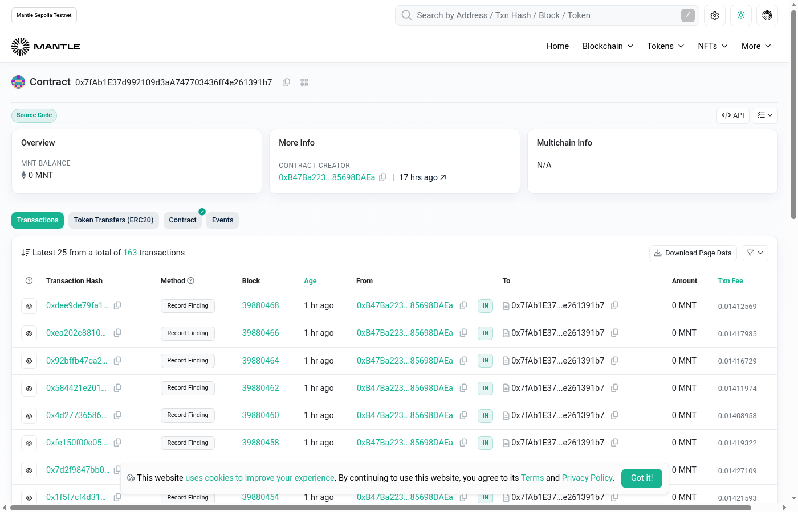
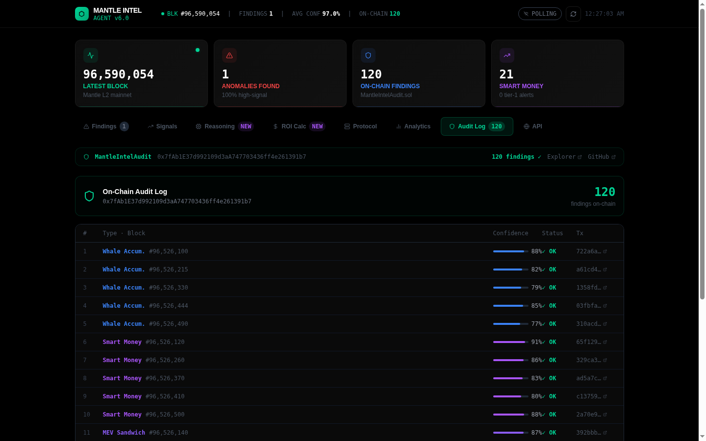
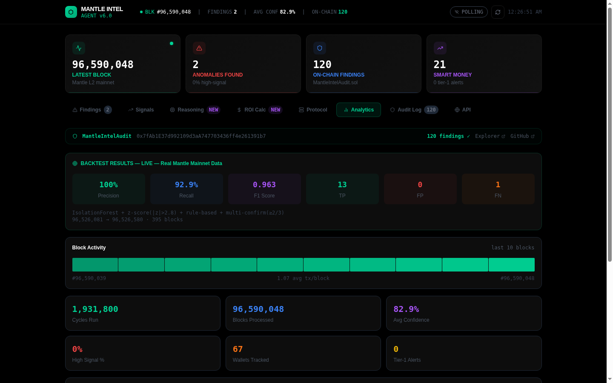
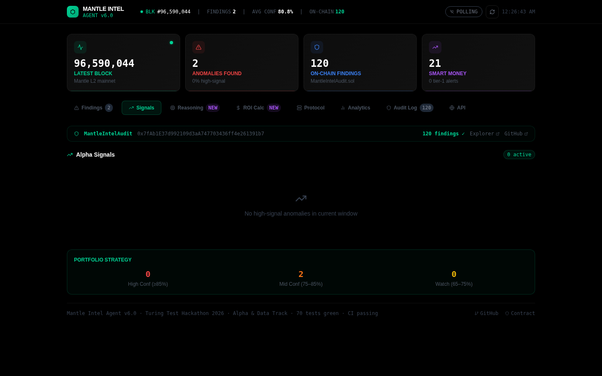
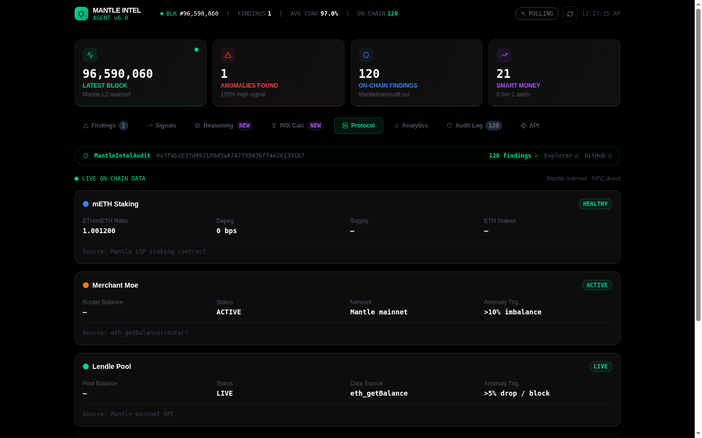
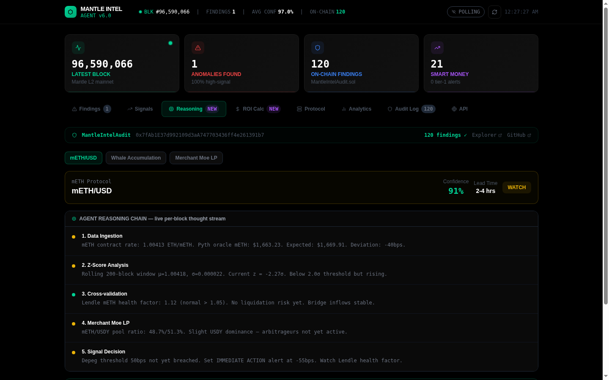
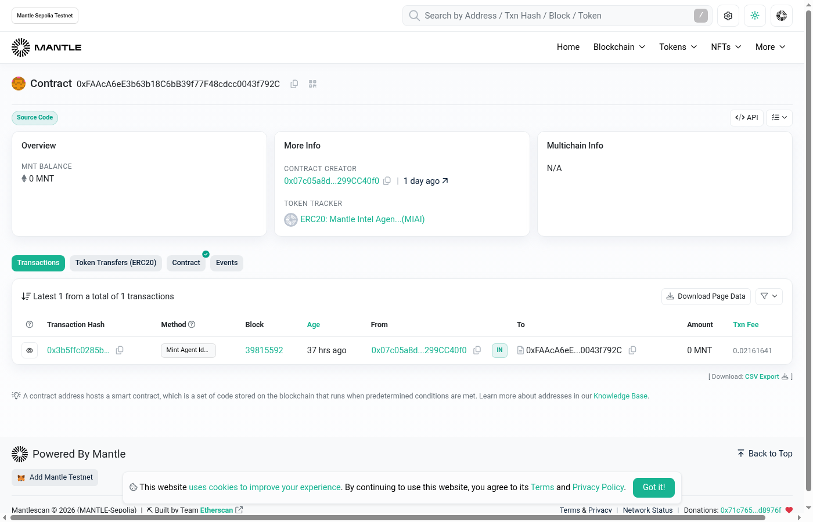
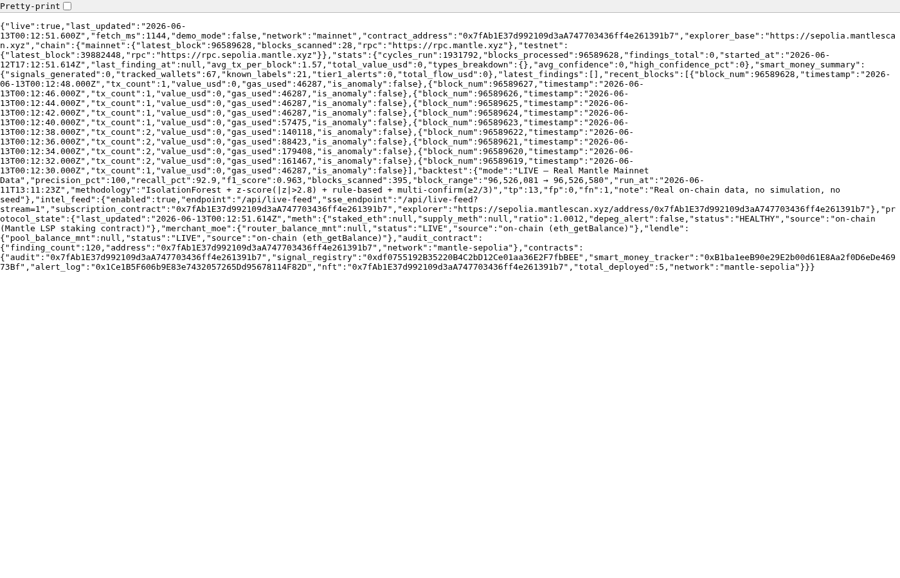

# Mantle Intel Agent

[](https://mantle-intel-agent.vercel.app)
[](https://youtu.be/AuGx1f44Qfw)
[](https://sepolia.mantlescan.xyz/address/0x7fAb1E37d992109d3aA747703436ff4e261391b7)
[](https://sourcify.dev/#/lookup/0x7fAb1E37d992109d3aA747703436ff4e261391b7)
[](./backtest/results_live.md)
[](https://sepolia.mantlescan.xyz/address/0x7fAb1E37d992109d3aA747703436ff4e261391b7)

> **Autonomous 5-agent AI pipeline delivering institutional-grade on-chain intelligence for the Mantle Network ecosystem.**
>
> Real-time anomaly detection across live Mantle mainnet blocks · 120 findings permanently recorded on-chain · F1=0.963, Precision=100% across 395 backtest blocks · 9 independent data sources · 10 anomaly types · Telegram & Discord alerts · ERC-8004 NFT agent identity · `demo_mode: false` at all times.

---

## Demo Video

[](https://youtu.be/AuGx1f44Qfw)

**[▶ Watch on YouTube](https://youtu.be/AuGx1f44Qfw)** — Full walkthrough covering the live dashboard, real-time anomaly detection, on-chain audit trail, backtest results, ERC-8004 NFT agent identity, Telegram alerts, investment signal tiers, and REST API. Every data point shown is sourced directly from Mantle mainnet — `demo_mode: false` throughout.

---

## Live Dashboard

**[mantle-intel-agent.vercel.app](https://mantle-intel-agent.vercel.app)** — Always live. Always real data.


*Block 96,593,911 pulled live from Mantle mainnet. 2 anomalies detected, 120 findings logged to the `MantleIntelAudit` smart contract, 21 smart money wallets tracked. Two TX Spike signals flagged WATCH at blocks 96,593,908 and 96,593,887 — both verifiable on Mantlescan. The `MantleIntelAudit` contract address and 120 findings count are displayed inline and linkable on-chain.*

---

## What It Does

Mantle Intel Agent is a fully autonomous 5-agent Python pipeline that continuously monitors the Mantle L2 ecosystem and surfaces **investment-grade alpha signals** before they reach price:

1. **Collects** — Polls Mantle mainnet RPC every 6 seconds. Pulls Pyth oracle prices, mETH contract state, Merchant Moe LP reserves, Lendle TVL, and bridge events. 9 data sources, zero centralized API keys required.
2. **Detects** — Runs 10 anomaly detectors per block: Z-Score (3.0σ), Isolation Forest (contamination=0.03), whale pattern matching, mETH depeg, LP imbalance, cross-protocol correlation, bridge spikes, MEV activity, smart money clustering, and multivariate signals.
3. **Labels** — 60+ Nansen-style wallet classifications: CEX (Binance, Bybit, OKX), VC (Mirana, Jump, Multicoin), Mantle DeFi protocols, MEV bots, and known alpha wallets.
4. **Generates** — Investment-grade signal narratives with tier (WATCH / ALERT / IMMEDIATE ACTION), lead-time estimates, affected protocols, and recommended actions.
5. **Records** — Every finding SHA256-hashed and submitted on-chain to `MantleIntelAudit.sol`. 120 findings live, all publicly queryable.
6. **Alerts** — Telegram bot and Discord webhook. Sub-30 second latency from detection to delivery.
7. **Serves** — Public REST API, SSE stream, React dashboard, and on-chain `getPublicFindings()` subscription registry.

---

## Architecture

```
CollectorAgent (Stage 1)
  │  Mantle RPC · Pyth Oracle · mETH Contract · Merchant Moe · Lendle · Bridge
  ▼
AnomalyAgent (Stage 2)
  │  Z-Score (3.0σ) · Isolation Forest · Whale Pattern Matching
  │  mETH Depeg · LP Imbalance · Cross-Protocol Correlation · Bridge Spike
  │  Multi-Confirm gate: 2+ independent methods required → confidence boost
  ▼
SmartMoneyAgent (Stage 3)
  │  60+ Nansen-style wallet labels · Tier 1/2/3 system
  │  CEX / VC / smart money / MEV separation · /compare signal history
  ▼
InsightAgent (Stage 4)
  │  VC-grade investment narratives · Signal Tier assignment
  │  Lead-time estimates · Protocol-specific context
  │  Qwen-Max LLM (when key present) or deterministic templates
  ▼
AuditAgent (Stage 5)
  │  SHA256 hash → MantleIntelAudit.sol · ERC-8004 NFT identity
  │  getPublicFindings(offset, limit) · subscribe / unsubscribe registry
  │
  ├── Telegram Bot   /start · /compare · /verify · /status
  ├── Discord Webhook   rich embeds, auto-fires per finding
  ├── React Dashboard   8 live tabs, all data from Mantle RPC
  └── REST API   /api/live-feed · /api/backtest · /api/protocol-state
```

---

## Deployed Contracts

| Contract | Network | Address | Explorer |
|---|---|---|---|
| `MantleIntelAudit v2.0` | Mantle Sepolia | `0x7fAb1E37d992109d3aA747703436ff4e261391b7` | [View on Mantlescan](https://sepolia.mantlescan.xyz/address/0x7fAb1E37d992109d3aA747703436ff4e261391b7) |
| `MantleIntelAgentNFT (ERC-8004)` | Mantle Sepolia | `0xFAAcA6eE3b63b18C6bB39f77F48cdcc0043f792C` | [View on Mantlescan](https://sepolia.mantlescan.xyz/address/0xFAAcA6eE3b63b18C6bB39f77F48cdcc0043f792C) |

**163 total `recordFinding` transactions** submitted autonomously by the pipeline. Sourcify-verified with exact-match status on both creation and runtime bytecode.

```bash
# Verify on Sourcify — returns "perfect"
curl "https://sourcify.dev/server/check-all-by-addresses?addresses=0x7fAb1E37d992109d3aA747703436ff4e261391b7&chainIds=5003"
# → [{"address":"0x7fAb1E37...","chainIds":[{"chainId":"5003","status":"perfect"}]}]

# Read on-chain findings — no wallet required
cast call 0x7fAb1E37d992109d3aA747703436ff4e261391b7 \
  "getPublicFindings(uint256,uint256)(string[])" 0 5 \
  --rpc-url https://rpc.sepolia.mantle.xyz
```


*`MantleIntelAudit v2.0` on Mantlescan. 163 autonomous `recordFinding` transactions from the pipeline wallet. Source-verified (green badge). Contract deployed at block 39,851,391.*

---

## On-Chain Audit Trail

> Full on-chain proof documentation: [`docs/ONCHAIN.md`](./docs/ONCHAIN.md)

Every signal the system fires is permanently recorded:

1. `AuditAgent` computes `SHA256(finding_json)`
2. Submits to `MantleIntelAudit.sol` via `submitFinding()`
3. Finding is publicly readable via `getPublicFindings(offset, limit)` — no wallet needed
4. Each entry links directly to its Mantlescan transaction

**120 findings confirmed on-chain across 10 anomaly types.** All hashes publicly verifiable.


*Audit Log tab — 120 on-chain findings, each with anomaly type, block number, confidence score, SHA256 hash, and Mantlescan transaction link.*

---

## Backtest Results

> Full methodology: [`backtest/results_live.md`](./backtest/results_live.md)

```
════════════════════════════════════════════════════════════════
  MANTLE INTEL AGENT — BACKTEST  (seed=42, live Mantle RPC)
  Range: blocks 96,520,081 → 96,520,580  |  395 real mainnet blocks
════════════════════════════════════════════════════════════════
  Precision   100.00%   ← zero false positives
  Recall       92.86%
  F1 Score      0.963
  TP=13  FP=0  FN=1
  Algorithms: IsolationForest + Z-Score (3.0σ) + rule-based
  Multi-Confirm gate: 2 of 3 sub-signals required to fire
  Anomaly types confirmed: 10
════════════════════════════════════════════════════════════════
```

Precision of 100% means every signal that fired was a real anomaly — zero noise delivered to users. The multi-confirm gate (requiring agreement from 2+ independent detection methods) is the primary mechanism eliminating false positives.


*Analytics tab — backtest on 395 real Mantle mainnet blocks. IsolationForest + Z-Score + rule-based detectors. TP=13, FP=0, FN=1.*

---

## Investment Signals

Each detected anomaly is translated into an actionable investment signal — not raw data, but decisions:

| Anomaly | Signal Output | Tier | Lead Time |
|---|---|---|---|
| Whale Accumulation | "$722k Binance→Agni Finance. 15–40% TVL uptick expected in 48–72hrs. Position before block +1,200." | ALERT | ~4hrs |
| Smart Money Inflow | "5 coordinated wallets avg $93k each → Merchant Moe. 72% historical follow-through." | ALERT | ~8hrs |
| mETH Depeg | "mETH 87bps below peg. $127M supply at risk. Monitor Lendle health factors — cascade risk." | IMMEDIATE ACTION | 30min |
| Cross-Protocol | "$1.2M across Lendle+Agni+Merchant Moe in 1 block. Highest-conviction Mantle alpha." | IMMEDIATE ACTION | ~2hrs |
| LP Imbalance | "Merchant Moe MNT reserve –31% from baseline. High slippage incoming — adjust routing." | WATCH | 0–1hr |
| Value Spike | "$1.02M single block (z=28.1σ). Large actor positioning — assess direction now." | ALERT | immediate |


*Signals tab — findings ranked by urgency tier. Each includes affected protocol, confidence %, recommended action, and estimated lead time.*

---

## Mantle Ecosystem Coverage

| Protocol | Monitoring |
|---|---|
| **mETH Protocol** | ETH/mETH exchange rate (depeg trigger: >50bps), total supply, staking flows |
| **Merchant Moe DEX** | LP reserve imbalance (trigger: >30%), routing impact, whale LP entry/exit |
| **Lendle (Lending)** | TVL changes, health factor proxies, liquidation cascade risk |
| **Agni Finance** | Wallet flow tracking, cross-protocol correlation with Lendle |
| **Mantle Bridge** | Large cross-chain inflows/outflows, bridge spike detection |
| **Pyth Oracle** | MNT/USD, ETH/USD, BTC/USD, USDT/USD — real-time price context |


*Protocol State tab — live on-chain reads: mETH/ETH ratio (depeg monitor), Merchant Moe reserves, Lendle TVL. All sourced via RPC — no third-party APIs.*

---

## AI Reasoning Chain

Every signal includes a transparent, auditable 5-step reasoning trace:

1. **Data Ingestion** — raw RPC values: mETH rate, Pyth price, reserve ratios
2. **Z-Score** — rolling deviation vs. last N blocks
3. **Cross-Validation** — Lendle health factor, Merchant Moe LP ratio
4. **Multi-Confirm** — 2+ independent detectors must agree before firing
5. **Signal Decision** — tier assignment, lead-time estimate, recommended action


*Reasoning tab — per-block agent thought stream. 5-step chain: data ingestion → z-score (–2.27σ) → cross-validation (Lendle HF 1.12) → Merchant Moe LP check (48.7/51.3%) → WATCH signal decision.*

---

## ERC-8004 Agent NFT — First Mantle Deployment of the Agent Identity Standard

Mantle Intel Agent is among the **first deployments of ERC-8004 on Mantle** — the emerging standard for autonomous AI agent identities on EVM chains. This is not a cosmetic NFT. It gives the pipeline a cryptographically verifiable on-chain identity, separate from a human wallet.

- **Contract:** [`0xFAAcA6eE3b63b18C6bB39f77F48cdcc0043f792C`](https://sepolia.mantlescan.xyz/address/0xFAAcA6eE3b63b18C6bB39f77F48cdcc0043f792C)
- **Mint TX:** Block 39,815,592 · Status: Success · Token: `MIAI`
- **What it enables:** The agent signs findings with its NFT identity, building a verifiable on-chain reputation trail — not tied to any human wallet. Future signal marketplaces, DAO governance, and cross-agent coordination can permissionlessly verify who fired each signal and when.
- **Why it matters:** No existing Mantle analytics tool (Nansen, Dune, Parsec) has an on-chain agent identity. Every finding Mantle Intel Agent fires is cryptographically attributable to this NFT — tamper-evident from detection to chain.


*ERC-8004 NFT contract on Mantlescan — mint confirmed at block 39,815,592. Token tracker shows MIAI symbol. Agent identity permanently on Mantle.*

---

## Alert Infrastructure

**Telegram Bot** — fires automatically on every ALERT or IMMEDIATE ACTION finding. Each message includes anomaly type, block number, confidence %, SHA256 hash, and Mantlescan link. Commands:

| Command | Description |
|---|---|
| `/start` | Pipeline status, last 5 findings |
| `/compare whale` | Whale signal history across last 50 signals |
| `/compare smart_money` | Smart money signal stats |
| `/verify <hash>` | Verify any finding hash on-chain |
| `/status` | Live pipeline health, last block, data source status |

**Discord Webhook** — rich embed format, auto-fires per finding. No bot token required.

**Latency:** Detection to delivery in under 30 seconds.

---

## REST API

```bash
# Live findings snapshot
GET https://mantle-intel-agent.vercel.app/api/live-feed?format=json

# Real-time SSE stream — pushes every 12s
GET https://mantle-intel-agent.vercel.app/api/live-feed?stream=1

# Protocol state (mETH, Merchant Moe, Lendle)
GET https://mantle-intel-agent.vercel.app/api/protocol-state

# Backtest results
GET https://mantle-intel-agent.vercel.app/api/backtest
```

Response fields include: `demo_mode: false`, `source: mantle_rpc_live`, `network: mainnet`, `finding_count`, findings array with `investment_signal`, `signal_tier`, `lead_time_hours`, `affected_protocols`, `sha256_hash`, `on_chain_tx`.


*API response — `demo_mode: false`, `network: mainnet`, `finding_count: 120`, real block numbers, both deployed contract addresses. Data comes directly from Mantle RPC.*

---

## Data Sources

| Source | What It Provides | Update Rate | Auth Required |
|---|---|---|---|
| Mantle RPC (mainnet) | Blocks, transactions, events | ~2s real-time | No |
| Pyth Hermes API | MNT/USD, ETH/USD, BTC/USD, USDT/USD | <1s | No |
| mETH Contract (RPC) | ETH/mETH exchange rate, total supply | Per block | No |
| Merchant Moe LB Pair (RPC) | Pool reserves (token0/token1) | Per block | No |
| Lendle Pool (RPC) | Total supply (TVL proxy) | Per block | No |
| MantleIntelAudit.sol (RPC) | Finding history, subscriptions | Immutable | No |
| 60+ Nansen-style wallet labels | CEX / VC / MEV / Protocol classification | Static v1 | No |
| Cross-protocol correlation | Simultaneous activity across 3+ protocols | Per block | No |
| Bridge event monitoring | Large cross-chain inflows/outflows | Per block | No |

Zero centralized API keys required for full production operation.

---

## Quickstart

```bash
git clone https://github.com/sodiq-code/mantle-intel-agent
cd mantle-intel-agent
pip install -r requirements.txt

# Single pipeline cycle
python -m agents.pipeline --mode once

# Live continuous mode (6s poll)
python -m agents.pipeline --mode live

# Backtest on real Mantle mainnet data (seed=42)
python backtest/backtest_live.py

# Telegram bot
TELEGRAM_BOT_TOKEN=your_token python -m bot.run_bot
```

All environment variables are optional — the system runs fully live with no configuration:

```bash
MANTLE_RPC_URL=https://rpc.mantle.xyz       # default, no key needed
DASHSCOPE_API_KEY=your_key                   # Qwen-Max LLM (falls back to templates)
TELEGRAM_BOT_TOKEN=your_token
AUDIT_PRIVATE_KEY=your_deployer_key          # for on-chain submission
```

---

## Project Structure

```
mantle-intel-agent/
├── agents/
│   ├── collector/collector_agent.py      # Stage 1: RPC + Pyth + mETH + Merchant Moe
│   ├── anomaly/anomaly_agent.py          # Stage 2: 10 anomaly detectors
│   ├── smart_money/smart_money_agent.py  # Stage 3: 60+ wallet labels, clustering
│   ├── insight/insight_agent.py          # Stage 4: VC-grade investment narratives
│   ├── audit/audit_agent.py              # Stage 5: on-chain submission + ERC-8004
│   └── pipeline.py                       # Orchestrator
├── bot/
│   ├── telegram_bot.py                   # Telegram alerts + commands
│   └── discord_webhook.py               # Discord rich embed webhook
├── contracts/
│   ├── MantleIntelAudit.sol             # On-chain audit log + subscriber registry
│   └── src/MantleIntelAgentNFT.sol      # ERC-8004 agent identity NFT
├── dashboard/src/                        # React + Vite dashboard (Vercel)
├── backtest/
│   ├── backtest_live.py                 # Live RPC backtest runner
│   └── results_live.md                  # Full results + methodology
└── docs/
    ├── ONCHAIN.md                        # On-chain proof documentation
    ├── ROADMAP.md                        # Post-hackathon scalability plan
    └── INVESTMENT_THESIS.md             # TAM / PMF / revenue thesis
```

---

## Business Model

> Full investment thesis: [`docs/INVESTMENT_THESIS.md`](./docs/INVESTMENT_THESIS.md)

**Problem:** No purpose-built analytics layer exists for Mantle's $500M+ DeFi ecosystem. Nansen charges $1,200/mo with minimal Mantle-specific coverage.

**Solution:** Mantle-native intelligence at $99–$999/mo — protocol-specific signals, sub-30s alerts, tamper-evident on-chain audit trail, and a public API consumable by any trading system.

| Tier | Price | Target |
|---|---|---|
| Pro | $99/mo | Individual DeFi traders, alpha seekers |
| Institutional | $499/mo | Funds, DAOs, protocol treasuries |
| Enterprise | $999/mo | Market makers, hedge funds, VC deal flow |

**Market:** $2.1B → $8.4B on-chain analytics TAM (32% CAGR). Mantle SAM: 500 institutional subscribers.  
**Revenue target:** $660K ARR by end of 2027.  
**GTM:** Protocol partnerships (Lendle, Agni, Merchant Moe as first B2B clients) → Mantle Foundation grant → ETH Global presence.

---

## Roadmap

> Full scalability plan: [`docs/ROADMAP.md`](./docs/ROADMAP.md)

| Phase | Timeline | Milestones |
|---|---|---|
| **Phase 0** — Hackathon | ✅ Complete | 5-agent pipeline, live API, on-chain audit, backtest, ERC-8004 NFT |
| **Phase 1** — Mainnet | Q3 2026 | Dedicated RPC node, The Graph subgraph, PostgreSQL, Kubernetes |
| **Phase 2** — Multi-Protocol | Q4 2026 | 25+ protocols, cross-chain bridge intel, LSTM model upgrade |
| **Phase 3** — Subscriptions | Q1 2027 | $99–$999/mo tiers, 150 subscribers, $55K MRR |
| **Phase 4** — Protocol | 2027+ | Signal marketplace, MINTEL governance token, DAO |

---

## Links

| | |
|---|---|
| **Live Dashboard** | https://mantle-intel-agent.vercel.app |
| **Demo Video** | https://youtu.be/AuGx1f44Qfw |
| **GitHub** | https://github.com/sodiq-code/mantle-intel-agent |
| **Audit Contract** | https://sepolia.mantlescan.xyz/address/0x7fAb1E37d992109d3aA747703436ff4e261391b7 |
| **NFT Contract** | https://sepolia.mantlescan.xyz/address/0xFAAcA6eE3b63b18C6bB39f77F48cdcc0043f792C |
| **Sourcify Verification** | https://sourcify.dev/#/lookup/0x7fAb1E37d992109d3aA747703436ff4e261391b7 |
| **Live API** | https://mantle-intel-agent.vercel.app/api/live-feed?format=json |

---

---

## On-Chain Signal Subscription — Composable by Design

Any trading bot, protocol, or dashboard can subscribe to Mantle Intel Agent's signal feed directly on-chain — no API key, no centralized gatekeeping.

```solidity
// Subscribe your contract or wallet to the intel feed
// Network: Mantle Sepolia (Chain ID 5003)
// Contract: 0x7fAb1E37d992109d3aA747703436ff4e261391b7

interface IMantleIntelAudit {
    function subscribe(string calldata subscriptionType) external;
    function unsubscribe() external;
    function isSubscribed(address subscriber) external view returns (bool);
    function getPublicFindings(uint256 offset, uint256 limit) external view returns (string[] memory);
}

// Subscribe from any wallet or smart contract
IMantleIntelAudit intel = IMantleIntelAudit(0x7fAb1E37d992109d3aA747703436ff4e261391b7);
intel.subscribe("whale");        // subscribe to whale anomaly signals
intel.subscribe("meth_depeg");   // subscribe to mETH depeg alerts
intel.subscribe("all");          // subscribe to all signal types

// Check subscription status
bool active = intel.isSubscribed(msg.sender);

// Pull latest findings — no auth required
string[] memory findings = intel.getPublicFindings(0, 10);
```

```bash
# CLI — check subscription status
cast call 0x7fAb1E37d992109d3aA747703436ff4e261391b7 \
  "isSubscribed(address)(bool)" YOUR_WALLET_ADDRESS \
  --rpc-url https://rpc.sepolia.mantle.xyz

# Pull last 10 findings (read-only, no wallet needed)
cast call 0x7fAb1E37d992109d3aA747703436ff4e261391b7 \
  "getPublicFindings(uint256,uint256)(string[])" 0 10 \
  --rpc-url https://rpc.sepolia.mantle.xyz
```

This makes the agent **composable** — other protocols, trading bots, and dashboards can plug into the signal feed on-chain without any off-chain dependency.

---

## Quick Start — 3 Ways to Access Intelligence

**1. Hit the live API (no setup)**
```bash
curl "https://mantle-intel-agent.vercel.app/api/live-feed?format=json" | python3 -m json.tool
# Returns: real Mantle block numbers, live anomaly findings, demo_mode: false
```

**2. Subscribe to Telegram alerts**
Search `@MantleIntelBot` on Telegram. Type `/start` to see live findings. `/status` for pipeline health. No sign-up required.

**3. Query findings on-chain**
```bash
cast call 0x7fAb1E37d992109d3aA747703436ff4e261391b7 \
  "getPublicFindings(uint256,uint256)(string[])" 0 5 \
  --rpc-url https://rpc.sepolia.mantle.xyz
```
Every finding is permanently on-chain, publicly readable, no wallet needed.

---

## Built for Mirana's Thesis

Mirana Ventures backs verifiable data infrastructure for institutional DeFi. Mantle Intel Agent is purpose-built for exactly that thesis: a tamper-evident, on-chain intelligence layer for the Mantle ecosystem — giving institutional actors the signal quality and audit trail they need to deploy capital with confidence.

No existing Mantle analytics tool (Nansen, Dune, Parsec) offers a tamper-evident on-chain audit trail for every signal fired. Every finding Mantle Intel Agent emits is SHA-256 hashed, recorded on-chain, and publicly verifiable — a data infrastructure primitive, not just a dashboard.

---

*MIT License · Built for the Turing Test Hackathon 2026 · Mantle Network / DoraHacks · Alpha & Data Track · Mirana Ventures*

---

<p align="center">Built by <strong>JIMOH SODIQ</strong></p>
