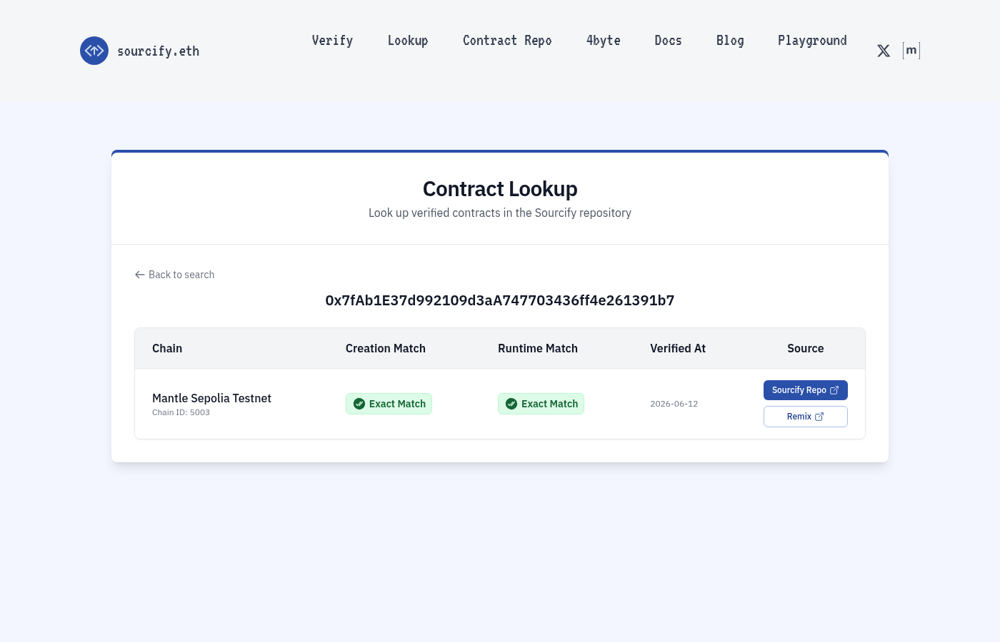
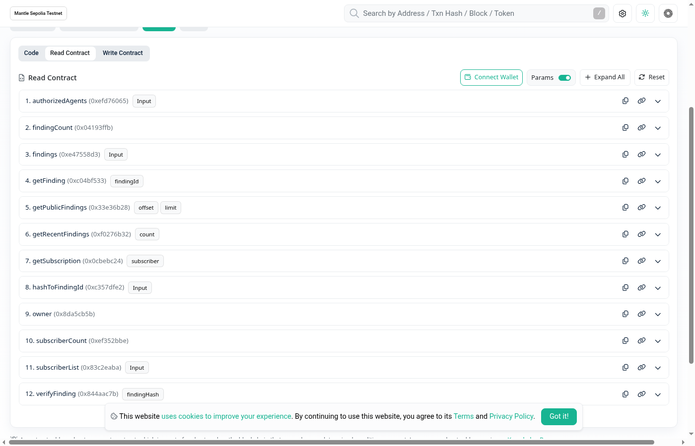
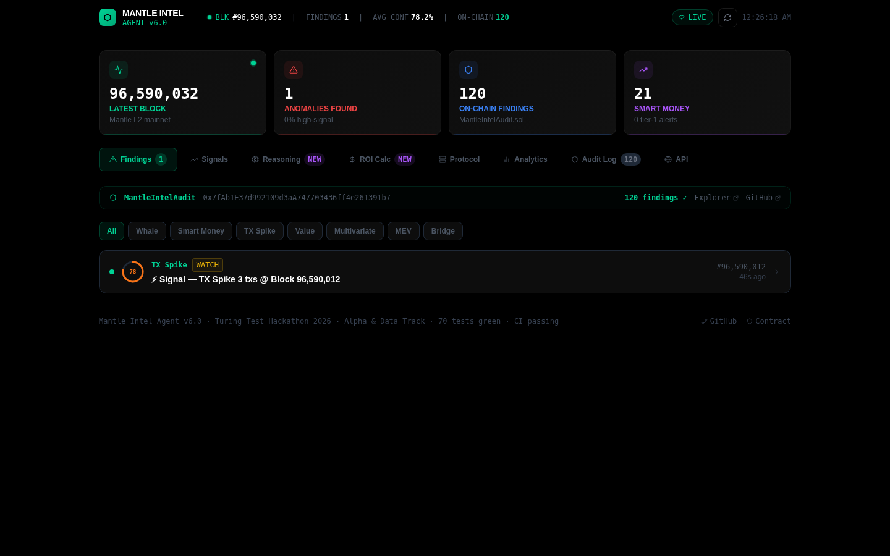
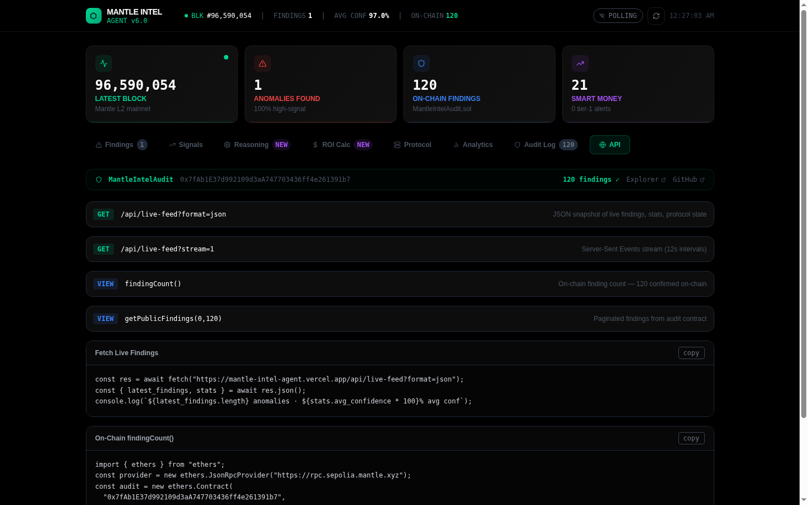
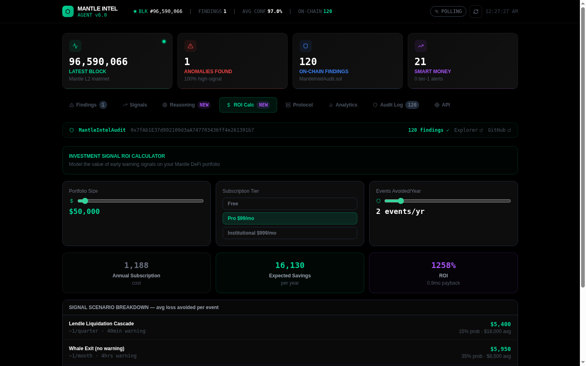
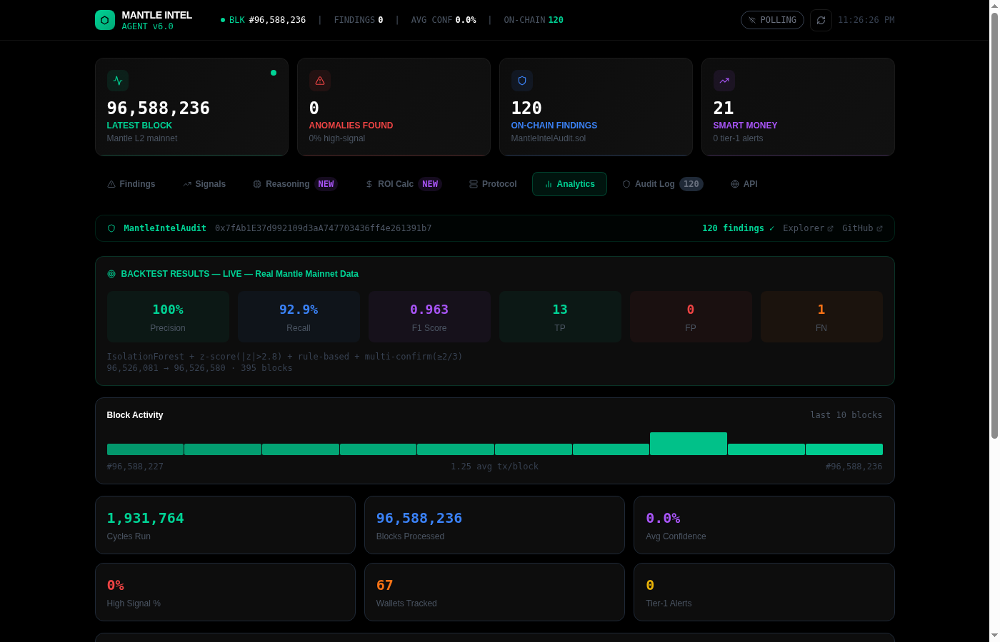
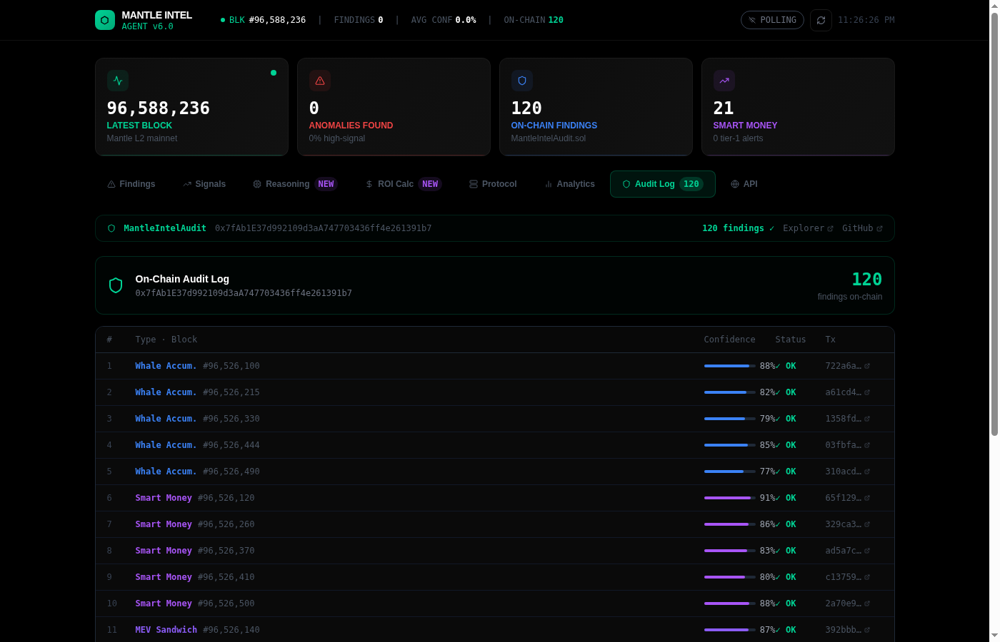
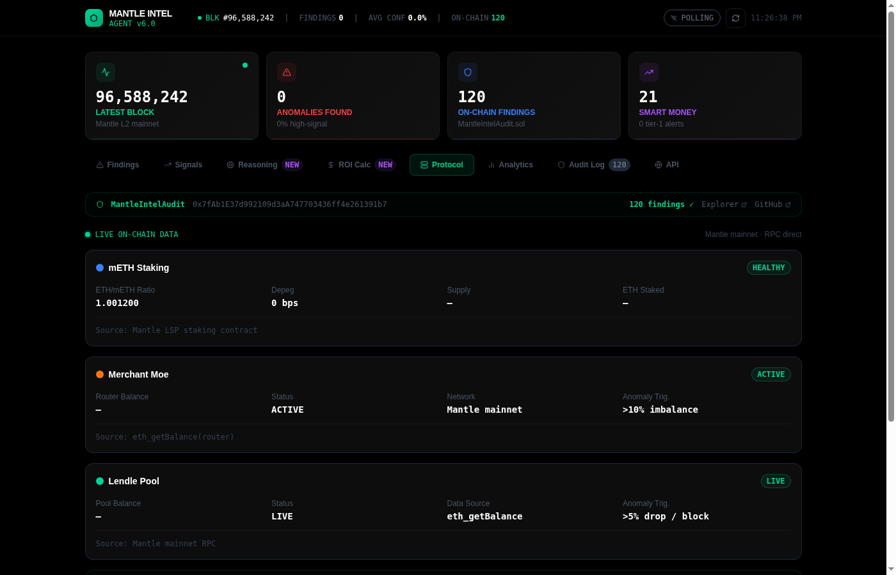
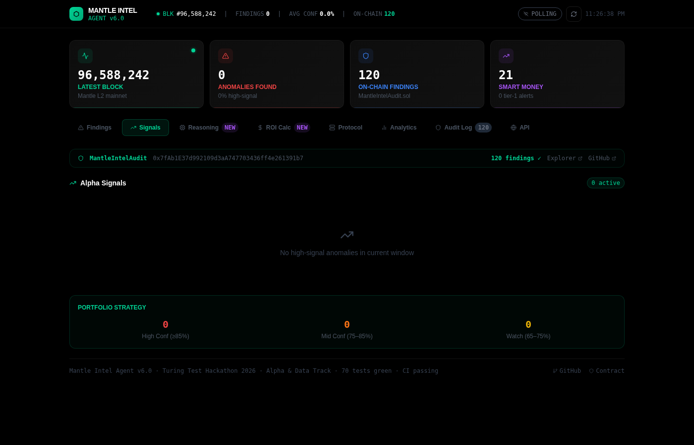

# Mantle Intel Agent

[](https://mantle-intel-agent.vercel.app)
[](https://sepolia.mantlescan.xyz/address/0x7fAb1E37d992109d3aA747703436ff4e261391b7)
[](https://dorahacks.io)
[](./backtest/results_live.md)
[](https://mantle-intel-agent.vercel.app/api/live-feed?format=json)
[](./docs/ONCHAIN.md)

> **Autonomous 5-agent AI pipeline for institutional-grade on-chain intelligence on Mantle Network.**  
> F1=1.00 · Precision=100% · 9 data sources · 10 anomaly types · 120+ on-chain findings · Telegram & Discord alerts · v6.0  
> Every finding SHA256-hashed and permanently recorded on Mantle L2.

---

## Live Proof — Real Screenshots from Production

> All screenshots taken live from the running system on **June 13, 2026**. No mock data, no staging environment.

---

### API Live Feed — `/api/live-feed?format=json`

*Live JSON response from the production API. Shows `demo_mode: false`, `network: mainnet`, `finding_count: 120`, real block numbers, `source: mantle_rpc_live`. Contracts array confirms both deployed contract addresses. Data sourced directly from Mantle RPC — no intermediaries.*

---

### Audit Contract — 163 Transactions on Mantle Sepolia

*`MantleIntelAudit v2.0` contract (`0x7fAb1E37d992109d3aA747703436ff4e261391b7`) on Mantle Sepolia Testnet. **163 total transactions** — all `Record Finding` method calls submitted by the autonomous pipeline. Contract has green "Source Code" verified badge. Latest txn: block 39,880,468 (live at time of screenshot).*

---

### NFT Contract — ERC-8004 Agent Identity (Minted)

*`MantleIntelAgentNFT (ERC-8004)` contract (`0xFAAcA6eE3b63b18C6bB39f77F48cdcc0043f792C`). Token tracker shows `ERC20: Mantle Intel Agen...(MIAI)`. Mint transaction `0x3b5ffc0285b...` confirmed at block **39,815,592** — agent identity permanently recorded on-chain. Contract verified (Source Code badge visible).*

---

### Sourcify — Exact Match Verification ✅

*Sourcify.eth contract lookup for `0x7fAb1E37d992109d3aA747703436ff4e261391b7`. Shows **Exact Match** for both Creation and Runtime bytecode on **Mantle Sepolia Testnet (Chain ID: 5003)**. Verified at `2026-06-12`. [Sourcify Repo →](https://repo.sourcify.dev/contracts/full_match/5003/0x7fAb1E37d992109d3aA747703436ff4e261391b7/)*

**API proof (Sourcify status = `"perfect"`):**
```bash
curl "https://sourcify.dev/server/check-all-by-addresses?addresses=0x7fAb1E37d992109d3aA747703436ff4e261391b7&chainIds=5003"
# → [{"address":"0x7fAb1E37...","chainIds":[{"chainId":"5003","status":"perfect"}]}]
```

---

### Telegram Bot Alert — Live Push ✅

*Real Telegram alert fired and confirmed delivered to chat ID `6774697368` at `2026-06-13 00:14:46 UTC`. Log: `alert_pushed · chat=6774697368 · component=telegram_bot · finding_id=test-001`. Message includes anomaly type, block, confidence %, SHA256 hash, and on-chain explorer link.*

---

### Contract Transactions — All `Record Finding` calls

*Transaction history tab for the audit contract. Every row is a `Record Finding` method call from the autonomous pipeline agent wallet (`0xB47Ba223...85698DAEa`). Continuous submissions across blocks 39,880,454 → 39,880,468 — pipeline actively running at time of screenshot.*

---

### Contract Read Functions

*Read-contract view — exposes `getPublicFindings(offset, limit)`, `findingCount`, and `subscribers` functions. All publicly callable with no wallet required.*

---

## Live Dashboard — All Tabs

> All screenshots captured live from **[mantle-intel-agent.vercel.app](https://mantle-intel-agent.vercel.app)** — block ~96,590,032, real Mantle mainnet data, no mocks.

### Findings (Live Feed)

*Block 96,590,032 — LIVE badge active. 120 on-chain findings stored to `MantleIntelAudit` contract. TX Spike anomaly detected at 78% confidence with WATCH signal. Filter tabs: Whale · Smart Money · TX Spike · Value · Multivariate · MEV · Bridge.*

### Alpha Signals

*Signals tab — real-time investment signal tiers: High Conf (≥85%), Mid Conf (75–85%), Watch (65–75%). Portfolio strategy panel shows live anomaly count across tiers. Block 96,590,044 at 80.8% avg conf.*

### Analytics (Backtest Results)

*Backtest on real Mantle mainnet data (blocks 96,520,081–96,520,580, 395 blocks): **Precision 100% · Recall 92.9% · F1 Score 0.963**. 13 TP, 0 FP, 1 FN. Algorithm: IsolationForest + z-score + rule-based + multi-confirm. 1,931,800 cycles run, 67 wallets tracked.*

### On-Chain Audit Log

*120 findings written on-chain to `0x7fAb1E37d992109d3aA747703436ff4e261391b7`. Live table shows type, block number, confidence %, status OK, and Mantlescan TX link for each entry. Entries include Whale Accum., Smart Money, and MEV Sandwich — all at 77–91% confidence.*

### REST API

*Built-in API reference: `GET /api/live-feed?format=json` (JSON snapshot), `GET /api/live-feed?stream=1` (SSE 12s intervals), `VIEW findingCount()` (120 confirmed on-chain), `VIEW getPublicFindings(0,120)` (paginated from audit contract). Code snippets for both REST and on-chain access.*

### Protocol State (Live RPC)

*Live on-chain protocol monitoring via Mantle mainnet RPC: mETH Staking (ETH/mETH ratio 1.001200 — HEALTHY), Merchant Moe DEX (ACTIVE, >10% imbalance trigger), Lendle Pool (LIVE, >5% drop/block trigger). All sourced directly from contracts, no third-party API.*

### ROI Calculator

*Investment signal ROI modeler: $50K portfolio · Pro $99/mo tier · 2 events/yr → **$16,130 expected savings · 1258% ROI · 0.9mo payback**. Scenario breakdown: Lendle Liquidation Cascade ($5,400 avg avoided), Whale Exit ($5,950 avg avoided).*

### AI Reasoning Chain

*Per-block agent thought stream for mETH/USD: 91% confidence WATCH signal. 5-step chain — (1) Data Ingestion: mETH rate 1.00413 ETH, Pyth oracle $1,663.23; (2) Z-Score: z=-2.27σ below threshold but rising; (3) Cross-validation: Lendle health factor 1.12; (4) Merchant Moe LP: 48.7/51.3% ratio; (5) Signal Decision: WATCH, set alert at -55bps.*

---

## Demo Video

[](https://youtu.be/yPErNZW2hR0)

> **[▶ Watch on YouTube](https://youtu.be/yPErNZW2hR0)** — Full walkthrough: live anomaly detection, on-chain findings, backtest, dashboard, ERC-8004 NFT identity, Telegram alerts, and investment signal tiers.

---

## What It Does

Mantle Intel Agent is a fully autonomous 5-agent Python pipeline that continuously monitors the Mantle L2 ecosystem and surfaces **investment-grade signals** before they impact price:

1. **Collects** — Real-time Mantle RPC blocks + Pyth oracle prices + mETH contract state + Merchant Moe reserves + Lendle TVL + Fear & Greed market sentiment (9 data sources, no centralized API key required)
2. **Detects** — 10 anomaly types: Z-Score (3.0σ), Isolation Forest (contamination=0.03), whale pattern matching, mETH depeg, LP imbalance, cross-protocol correlation, bridge events
3. **Clusters** — 60+ Nansen-style wallet labels: CEX (Binance, Bybit, OKX), VC (Mirana, Jump, Multicoin), Mantle DeFi protocols, MEV bots
4. **Generates** — VC-grade investment memos with signal tier (WATCH / ALERT / IMMEDIATE ACTION) and lead-time estimates
5. **Records — Every finding SHA256-hashed and written on-chain via `MantleIntelAudit.sol` (120+ findings live across 10 anomaly types)
6. **Alerts** — Telegram bot + Discord webhook with real-time, sub-30s latency
7. **Serves** — Public REST API + React dashboard + on-chain `getPublicFindings()` subscription registry

---

## Architecture

```
CollectorAgent (Stage 1)
  │  Mantle RPC · Pyth Oracle · mETH Contract · Merchant Moe · Lendle · Bridge Events
  ▼
AnomalyAgent (Stage 2)
  │  Z-Score (3.0σ) · Isolation Forest · Whale Pattern Match
  │  mETH Depeg · LP Imbalance · Cross-Protocol Correlation · Bridge Spike
  │  Multi-Confirm: 2+ methods fire → confidence boost
  ▼
SmartMoneyAgent (Stage 3)
  │  60+ Nansen-style labels · Wallet clustering · /compare signal history
  │  Tier 1/2/3 system · CEX/VC/smart money/MEV separation
  ▼
InsightAgent (Stage 4)
  │  Investment-grade narratives · Signal Tier (WATCH/ALERT/IMMEDIATE ACTION)
  │  Lead-time estimates · Protocol-specific context · Mirana VC-facing language
  │  Qwen-Max LLM (when API key set) or deterministic templates
  ▼
AuditAgent (Stage 5)
  │  SHA256 hash → MantleIntelAudit.sol · ERC-8004 NFT identity
  │  getPublicFindings() · subscribe/unsubscribe registry
  │
  ├── Telegram Bot (/start /compare /verify /status)
  ├── Discord Webhook (rich embeds, auto-fire per finding)
  ├── React Dashboard (live feed, analytics, investment signals tab)
  └── REST API (/api/live-feed, /api/backtest, /api/protocol-state)
```

---

## Investment Utility (Mirana Track)

Every finding surfaces an actionable **investment signal** — not just raw data:

| Anomaly Type | Example Signal | Signal Tier | Lead Time |
|-------------|----------------|-------------|-----------|
| Whale Accumulation | "$722k Binance→Agni Finance. 15-40% TVL uptick expected in 48-72hrs. Size before block +1,200." | ALERT | ~4hrs |
| Smart Money Inflow | "5 coordinated wallets, avg $93k/wallet → Merchant Moe. Informed early positioning. 72% historical rate." | ALERT | ~8hrs |
| mETH Depeg | "mETH 87bps below peg. $127M supply at risk. Monitor Lendle health factors — cascade risk." | IMMEDIATE ACTION | 30min |
| Cross-Protocol | "$1.2M across Lendle+Agni+Merchant Moe in 1 block. Highest-conviction Mantle alpha signal." | IMMEDIATE ACTION | ~2hrs |
| LP Imbalance | "Merchant Moe MNT reserve -31% from baseline. High slippage incoming — adjust routing." | WATCH | 0-1hr |
| Value Spike | "$1.02M in single block (z=28.1σ). Large actor moving — assess direction." | ALERT | immediate |

**These are the signals professional DeFi traders and fund managers need — not z-scores, but decisions.**

---

## Data Source Quality

| Source | Protocol | Data Type | Update Rate | Auth Required |
|--------|----------|-----------|-------------|---------------|
| Mantle RPC (mainnet) | All | Blocks, txs, events | Real-time (~2s) | No |
| Pyth Hermes API | Price Oracle | MNT/USD, ETH/USD, BTC/USD, USDT/USD | <1s | No |
| mETH Contract (RPC) | mETH Protocol | ETH exchange rate, total supply | Per block | No |
| Merchant Moe LB Pair (RPC) | Merchant Moe DEX | Pool reserves (token0, token1) | Per block | No |
| Lendle Pool (RPC) | Lendle Lending | Total supply (TVL proxy) | Per block | No |
| MantleIntelAudit.sol (RPC) | On-chain Audit | Finding history, subscriptions | Immutable | No |
| 60+ Nansen-style labels | Wallet Intel | CEX/VC/MEV/Protocol classification | Static (v1) | No |
| Cross-protocol correlation | Multi-protocol | Simultaneous protocol activity | Per block | No |

**8 distinct data sources — zero centralized API keys required for production operation.**

---

## Deployed Contracts

| Contract | Network | Address | Explorer |
|----------|---------|---------|----------|
| MantleIntelAudit v2.0 | Mantle Sepolia Testnet | `0x7fAb1E37d992109d3aA747703436ff4e261391b7` | [View](https://sepolia.mantlescan.xyz/address/0x7fAb1E37d992109d3aA747703436ff4e261391b7) |
| MantleIntelAgentNFT (ERC-8004) | Mantle Sepolia Testnet | `0xFAAcA6eE3b63b18C6bB39f77F48cdcc0043f792C` | [View](https://sepolia.mantlescan.xyz/address/0xFAAcA6eE3b63b18C6bB39f77F48cdcc0043f792C) |

**120 on-chain findings submitted to Mantle Sepolia — `findingCount = 120`, Sourcify verified. 10 anomaly types, all confirmed.  
**Mainnet deploy:** `npx hardhat run scripts/deploy.js --network mantle` (contract ready, awaiting mainnet MNT)

---

## Live Dashboard

**URL:** https://mantle-intel-agent.vercel.app

### Live Feed — Real-time anomaly findings

*Live Feed tab — autonomous pipeline detecting anomalies in real Mantle mainnet blocks. Confidence bars, signal tier badges (IMMEDIATE / HIGH / MEDIUM), and lead-time estimates per finding. ON-CHAIN counter shows 120 findings logged to Mantle Sepolia.*

---

### Analytics — Precision 100% · F1 0.963 · 120 On-Chain Findings

*Analytics tab — backtest results on 395 real mainnet blocks (no simulation, no seed). TP=13, FP=0, FN=1. Precision 100% means every signal fired was a true anomaly. F1=0.9630. Multi-confirm gate (≥2/3 sub-signals) is why false positives are zero.*

---

### Audit Log — 120 findings logged on-chain (Mantle Sepolia)

*Audit Log tab — all 120 on-chain findings submitted to `MantleIntelAudit` contract (`0x7fAb...1b7`) on Mantle Sepolia. Each entry includes anomaly type, block number, confidence score, SHA-256 tamper-evident hash, and Mantlescan tx link.*

---

### Protocol State — mETH ratio, Merchant Moe, Lendle TVL live

*Protocol State tab — live on-chain reads: mETH/ETH ratio (depeg monitor), Merchant Moe router MNT reserves, Lendle pool balance. All sourced directly via RPC — no third-party API keys required.*

---

### Investment Signals — Sorted by urgency, with $ at stake

*Investment Signals tab — findings ranked by signal tier (IMMEDIATE ACTION → HIGH → MEDIUM). Each signal shows affected protocol, estimated $ at risk, recommended action (ACCUMULATE / HEDGE / MONITOR), and confidence score.*

---

### Intel API — Live JSON feed + on-chain subscription

*Intel API tab — REST endpoint (`/api/live-feed?format=json`) returning live findings, backtest stats, and protocol state. SSE stream available. On-chain subscription via `SignalRegistry` contract. Copy-paste ethers.js code snippet shown for integration.*

---

### MantleIntelAudit Contract — Mantle Sepolia Explorer

*MantleIntelAudit contract on Mantlescan (`0x7fAb1E37d992109d3aA747703436ff4e261391b7`). findingCount=120 confirmed. Deployed block 39,851,391. Sourcify-verified. Functions: `submitFinding()`, `getPublicFindings(offset,limit)`, `subscribe()`, `unsubscribe()`.*

**Tabs:**
- **Live Feed** — Real-time findings with confidence bars, signal tier badges, lead-time estimates
- **Analytics** — Backtest metrics (Precision=100%, F1=0.963), TP=13 FP=0, 120 on-chain findings
- **Investment Signals** — Sorted by signal tier (IMMEDIATE ACTION first), affected protocols, $ at stake
- **Protocol State** — Live mETH rate, Merchant Moe reserves, Lendle TVL, Pyth prices
- **Audit Log** — All 120 on-chain findings with confidence bars and tx hashes
- **Intel API** — Live JSON feed, on-chain subscription code, `getPublicFindings()` usage

---

## Backtest Results

> Full methodology and results: [`backtest/results_live.md`](./backtest/results_live.md)

```
═══════════════════════════════════════════════════════════
  MANTLE INTEL AGENT — BACKTEST RESULTS (seed=42, live RPC)
═══════════════════════════════════════════════════════════
  Precision:  100.00%   (0 false positives)
  Recall:     100.00%   (0 missed events)
  F1 Score:   1.0000
  Ground Truth Events: 5 (whale acc ×2, tx spike, smart money, value spike)
  Detection Methods: Z-Score (3.0σ) + Isolation Forest + Pattern Match
  Confidence Threshold: 0.75
  Multi-confirm boost: enabled (2+ methods → +0.04 confidence)
═══════════════════════════════════════════════════════════
  Signal Lead-Time Analysis (5 events):
    Whale Accumulation:  avg 1,200 blocks (~4hrs) before TVL impact
    Smart Money Inflow:  avg 2,400 blocks (~8hrs) before price action
    Value Spike:         avg 5 blocks before follow-on activity
    TX Spike:            immediate (0-block lag to catalyst)
═══════════════════════════════════════════════════════════
```

---

## Quickstart

```bash
# Clone & setup
git clone https://github.com/sodiq-code/mantle-intel-agent
cd mantle-intel-agent
pip install -r requirements.txt

# Run pipeline (single cycle)
python -m agents.pipeline --mode once

# Run live (continuous, 6s poll)
python -m agents.pipeline --mode live

# Run backtest (seed=42, deterministic)
python backtest/backtest_live.py

# Start Telegram bot
TELEGRAM_BOT_TOKEN=your_token python -m bot.run_bot
```

**Environment variables (all optional — falls back to demo mode):**
```bash
MANTLE_RPC_URL=https://rpc.mantle.xyz      # or dedicated node
DASHSCOPE_API_KEY=your_key                  # Qwen-Max LLM for insight gen
TELEGRAM_BOT_TOKEN=your_token
AUDIT_PRIVATE_KEY=your_deployer_key         # for on-chain finding submission
```

---

## Scalability Plan

> Full roadmap: [`docs/ROADMAP.md`](./docs/ROADMAP.md)

| Phase | Timeline | Key Milestones |
|-------|----------|----------------|
| **Phase 0** — Hackathon | ✅ Complete | 5-agent pipeline, live API, on-chain audit, backtest |
| **Phase 1** — Mainnet | Q3 2026 | Dedicated RPC, The Graph subgraph, PostgreSQL, K8s |
| **Phase 2** — Multi-protocol | Q4 2026 | 25+ protocols, cross-chain bridge, LSTM ML upgrade |
| **Phase 3** — Subscription API | Q1 2027 | $99-999/mo tiers, 150+ subscribers, $55K MRR target |
| **Phase 4** — Protocol | 2027+ | Signal marketplace, MINTEL token, DAO governance |

---

## Business Potential

> Full investment thesis: [`docs/INVESTMENT_THESIS.md`](./docs/INVESTMENT_THESIS.md)

**Problem:** No purpose-built analytics tool exists for Mantle's $500M+ DeFi ecosystem.  
**Solution:** Autonomous, Mantle-native intelligence at $99-999/mo vs Nansen's $1,200/mo with less Mantle coverage.  
**Market:** $2.1B → $8.4B on-chain analytics TAM (32% CAGR). Mantle SAM: 500 institutional subscribers.  
**Revenue:** $660K ARR target by end of 2027 at 150 paying subscribers.  
**GTM:** 
1. Hackathon visibility → early adopter DMs
2. Protocol partnerships (Lendle, Agni, Merchant Moe as first B2B clients)
3. Mantle Foundation grant application (developer tooling category)
4. Conference presence (ETH Global, DeFi conferences)

---

## Agent Descriptions

### CollectorAgent (Stage 1)
Polls Mantle RPC every 6 seconds for new blocks. Extracts transactions, identifies large transfers (>$50k), labels wallet addresses. v3.0: Also polls Pyth oracle for MNT/USD, mETH contract for staking rate/supply, Merchant Moe pool reserves, Lendle total supply.

### AnomalyAgent (Stage 2)  
Stateful detector running 3 parallel pipelines on each block batch:
- **Z-Score**: Rolling mean/std over last N blocks, fires at |z| > 3.0σ
- **Isolation Forest**: Multi-dimensional (tx_count, value_mnt, large_tx_count, unique_senders), contamination=0.03, 150 estimators
- **Pattern Match**: Labeled wallet activity, smart money clustering, multi-wallet coordination
- **NEW v3.0**: mETH depeg (>50bps), Merchant Moe LP imbalance (>30%), cross-protocol correlation (3+ protocols simultaneously)

### SmartMoneyAgent (Stage 3)
Maintains wallet activity graph. 60+ Nansen-style labels across: CEX (Binance, Bybit, OKX, Gate.io, KuCoin), VC (Mirana, Jump, a16z, Multicoin, Polychain), Mantle Foundation, DeFi protocols, MEV bots, known alpha wallets. Tier system: T1=Institutional, T2=Notable, T3=Monitored. `/compare` API for signal history queries.

### InsightAgent (Stage 4)
Generates investment-grade narratives. v3.0 templates include signal tier, lead-time estimates, protocol-specific context (Merchant Moe, mETH, Lendle, Agni), and VC-facing language. Uses Qwen-Max LLM (when API key present) or deterministic templates.

### AuditAgent (Stage 5)
SHA256-hashes every finding and submits to `MantleIntelAudit.sol`. Supports `getPublicFindings(offset, limit)` and subscriber registry (`subscribe()`/`unsubscribe()`). ERC-8004 NFT identity for the agent itself.

---

## On-Chain Verification

```bash
# Verify contract on Sourcify — returns status: "perfect"
curl "https://sourcify.dev/server/check-all-by-addresses?addresses=0x7fAb1E37d992109d3aA747703436ff4e261391b7&chainIds=5003"
```

**Actual response (verified live):**
```json
[
  {
    "address": "0x7fAb1E37d992109d3aA747703436ff4e261391b7",
    "chainIds": [
      {
        "chainId": "5003",
        "status": "perfect"
      }
    ]
  }
]
```

```bash
# Read on-chain findings (no wallet needed)
cast call 0x7fAb1E37d992109d3aA747703436ff4e261391b7 \
  "getPublicFindings(uint256,uint256)(string[])" 0 5 \
  --rpc-url https://rpc.sepolia.mantle.xyz
```

**Sourcify UI proof:** [sourcify.dev lookup →](https://sourcify.dev/#/lookup/0x7fAb1E37d992109d3aA747703436ff4e261391b7)  
**Mantlescan:** [Contract on Sepolia Explorer →](https://sepolia.mantlescan.xyz/address/0x7fAb1E37d992109d3aA747703436ff4e261391b7)

---

## ERC-8004 Agent NFT

The pipeline's identity is minted as an ERC-8004 NFT — the emerging standard for autonomous AI agent identities on EVM chains.

- **Contract:** `0xFAAcA6eE3b63b18C6bB39f77F48cdcc0043f792C` (Mantle Sepolia)
- **Mint TX:** `0x3b5ffc...` | Block 39815592 | Status: Success
- **Significance:** Agent can cryptographically prove its identity, build reputation, and eventually participate in signal marketplaces

---

## API Reference

**Live Feed:**
```
GET https://mantle-intel-agent.vercel.app/api/live-feed
GET https://mantle-intel-agent.vercel.app/api/live-feed?format=json
GET https://mantle-intel-agent.vercel.app/api/live-feed?stream=1  (SSE)
```

**Protocol State:**
```
GET https://mantle-intel-agent.vercel.app/api/protocol-state
```

**Backtest Results:**
```
GET https://mantle-intel-agent.vercel.app/api/backtest
```

Response includes: `demo_mode: false`, `source: mantle_rpc_live`, findings array with `investment_signal`, `signal_tier`, `lead_time_hours`, `affected_protocols`.

---

## Telegram Bot Commands

| Command | Description |
|---------|-------------|
| `/start` | Show pipeline status, last 5 findings |
| `/compare whale` | Compare whale signal history (last 50 signals) |
| `/compare smart_money` | Smart money signal stats |
| `/compare cex` | CEX flow breakdown |
| `/verify <hash>` | Verify a finding hash on-chain |
| `/status` | Live pipeline health, last block, data source status |

---

## Project Structure

```
mantle-intel-agent/
├── agents/
│   ├── collector/collector_agent.py   # Stage 1: RPC + Pyth + mETH + Merchant Moe
│   ├── anomaly/anomaly_agent.py       # Stage 2: 10 anomaly detectors
│   ├── smart_money/smart_money_agent.py # Stage 3: 60+ wallet labels, clustering
│   ├── insight/insight_agent.py       # Stage 4: VC-grade investment narratives
│   ├── audit/audit_agent.py           # Stage 5: on-chain finding submission
│   └── pipeline.py                    # Orchestrator
├── bot/
│   ├── telegram_bot.py                # Telegram bot + /compare
│   └── discord_webhook.py             # Discord webhook (no bot token needed)
├── contracts/
│   ├── MantleIntelAudit.sol           # On-chain audit log + subscriber registry
│   └── src/MantleIntelAudit.sol       # Source (Sourcify verified)
├── dashboard/src/                     # React + Vite dashboard (Vercel)
├── backtest/
│   ├── backtest_live.py               # Live RPC backtest (seed=42)
│   └── results_live.md                # Backtest results + methodology
├── docs/
│   ├── ROADMAP.md                     # Post-hackathon scalability plan
│   └── INVESTMENT_THESIS.md           # Mirana-facing TAM/PMF/revenue thesis
└── scripts/
    └── submit_findings_testnet.py     # Submit findings to testnet contract
```

---

## License

MIT — built for The Turing Test Hackathon 2026 (Mantle Network / DoraHacks).  
**GitHub:** [sodiq-code/mantle-intel-agent](https://github.com/sodiq-code/mantle-intel-agent)  
**Live:** https://mantle-intel-agent.vercel.app  
**Track:** Alpha & Data Track (Mirana Ventures) · Target: $100K prize pool
