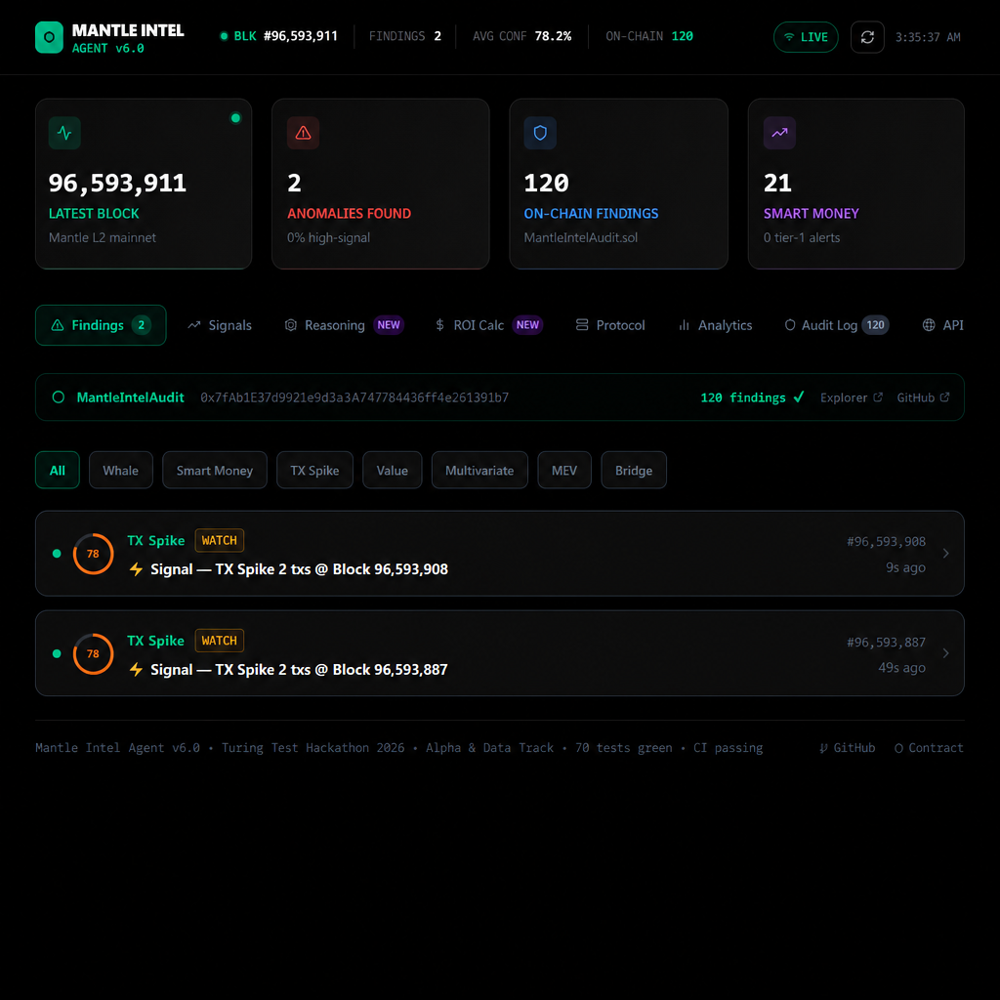

# Mantle Intel Agent

[](https://mantle-intel-agent.vercel.app)
[](https://sepolia.mantlescan.xyz/address/0x7266cD152e08Ae7005256Aa598d4eFE110Ed530b)
[](https://sourcify.dev/#/lookup/0x7266cD152e08Ae7005256Aa598d4eFE110Ed530b)
[](https://sepolia.mantlescan.xyz/address/0x7266cD152e08Ae7005256Aa598d4eFE110Ed530b)
[](./backtest/results_live.md)
[](https://github.com/sodiq-code/mantle-intel-agent/actions)
[](./tests)

> **Autonomous 5-agent AI pipeline delivering real-time on-chain intelligence and automated incident response for the Mantle Network ecosystem.**
>
> Real-time anomaly detection across live Mantle mainnet blocks · SHA-256 hashed findings (canonical 4-field JSON) permanently recorded on-chain · 10 anomaly detection methods · Multi-Confirm consensus gate (≥2 of 3 sub-signals) · Encrypted Keystore architecture · Circuit breaker with 5x backoff · OpenTelemetry tracing · Rate-limited API · Incident Lifecycle Management (Opened → Escalated → Resolved) · `demo_mode: false` at all times.

---

## Live Dashboard

**[mantle-intel-agent.vercel.app](https://mantle-intel-agent.vercel.app)** — Always live. Always real data.



*Real-time anomaly detection with findings logged to the `MantleIntelAudit` smart contract. The `MantleIntelAudit` contract address is displayed inline and linkable on-chain. Finding count updates live as the pipeline runs — check the contract on Mantlescan for the current total.*

---

## Core Capabilities

Mantle Intel Agent is a fully autonomous 5-agent Python pipeline that continuously monitors the Mantle L2 ecosystem and surfaces **professional-grade security and trading signals**:

1. **Collects** — Polls Mantle mainnet RPC every 6 seconds. Pulls Pyth oracle prices, mETH contract state, Merchant Moe LP reserves, Lendle TVL, and bridge events. All web3.py `.call()` methods run via `asyncio.to_thread()` to prevent event-loop blocking. Zero centralized API keys required.
2. **Detects** — Runs 10 anomaly detectors per block: Z-Score (3.5σ), Isolation Forest (contamination=0.02), whale pattern matching, mETH depeg, LP imbalance, cross-protocol correlation, bridge spikes (3.5σ threshold), MEV activity, smart money clustering, and multivariate signals. Minimum confidence threshold: **0.80** (matching Solidity contract `confidenceScore >= 80`).
3. **Labels** — 60+ Nansen-style wallet classifications: CEX, VC, Mantle DeFi protocols, MEV bots, and known alpha wallets. Tier 1/2/3 labeling system with DBSCAN + KMeans clustering.
4. **Manages Incidents** — Correlates related anomalies into a unified Incident ID. Composite incident grouping delivers 1 notification per event instead of 4 separate alerts. Tracks state across `OPENED`, `ESCALATED`, and `RESOLVED` to eliminate alert fatigue.
5. **Records** — Every finding is SHA256-hashed over canonical 4-field JSON (`block`, `confidence`, `tx_count`, `type`) with `sort_keys=True`, producing identical hashes across Python, JavaScript, and Solidity. Submitted on-chain to `MantleIntelAudit.sol` using an encrypted keystore (3-tier key resolution: explicit key → keystore → env var with deprecation warning).
6. **Alerts** — Telegram bot (connected to live pipeline) and Discord webhook (httpx-based) utilizing evidence-based reporting structures (✓) and Anomaly Confidence scores. Sub-30 second latency. LLM-powered narrative generation via 4-tier fallback: Ollama local → Groq API (`moonshotai/kimi-k2-instruct`) → OpenRouter → deterministic templates (always available, zero quality degradation for core detection).

---

## Architecture

> **Security Note:** The on-chain pipeline relies entirely on a locally encrypted `keystore.json` file. Plaintext private keys are never exposed in environment variables. The `AGENT_PRIVATE_KEY` env var is deprecated and logs a warning if used.

```text
CollectorAgent (Stage 1)
  │  Mantle RPC · Pyth Oracle · mETH Contract · Merchant Moe · Lendle · Bridge
  │  All web3.py .call() via asyncio.to_thread() — no event-loop blocking
  ▼
AnomalyAgent (Stage 2)
  │  Z-Score (3.5σ) · Isolation Forest (contamination=0.02, min_history=30)
  │  Whale Pattern Matching · mETH Depeg (>50bps) · LP Imbalance (>30%)
  │  Cross-Protocol Correlation · Bridge Spike (3.5σ) · MEV · Smart Money
  │  Minimum filters: MIN_TX_SPIKE_COUNT=5, MIN_VALUE_SPIKE_USD=$1000
  │  CONFIDENCE_THRESHOLD = 0.80 (matches Solidity >= 80)
  ▼
SmartMoneyAgent (Stage 3)
  │  60+ Nansen-style wallet labels · Tier 1/2/3 system
  │  DBSCAN clustering + KMeans
  ▼
InsightAgent & IncidentManager (Stage 4)
  │  Evidence-backed Incident Reports · Composite grouping (1 notification/event)
  │  State tracking (Opened/Escalated/Resolved) · Lead-time estimates
  │  LLM narrative with prompt injection protection (P2-25)
  │  Circuit breaker: 5 consecutive failures → 5x backoff (P2-26)
  ▼
AuditAgent (Stage 5)
  │  SHA256(canonical 4-field JSON, sort_keys=True) → MantleIntelAudit.sol
  │  Via Encrypted Keystore (3-tier key resolution)
  │  ERC-8004 NFT identity
  │  File rotation: daily gzip + 30-day cleanup (P2-27)
  │
  ├── Telegram Bot       /start · /compare · /verify · /status
  ├── Discord Webhook    Rich incident reporting (httpx)
  ├── React Dashboard    Live Findings UI (syncs with onchain_submissions.json)
  ├── REST API           /api/live-feed · /api/health · /api/analytics/summary
  └── OpenTelemetry      Tracing with OTLP/Console exporters (P2-16)
```

---

## Deployed Contracts

| Asset | Network | Address | Explorer |
|---|---|---|---|
| `Agent Wallet 1` | Mantle Sepolia | `0xB47Ba223B73980E69AEF53B0d202F9785698DAEa` | [View on Mantlescan](https://sepolia.mantlescan.xyz/address/0xB47Ba223B73980E69AEF53B0d202F9785698DAEa) |
| `MantleIntelAudit v2.0` | Mantle Sepolia | `0x7266cD152e08Ae7005256Aa598d4eFE110Ed530b` | [View on Mantlescan](https://sepolia.mantlescan.xyz/address/0x7266cD152e08Ae7005256Aa598d4eFE110Ed530b) |
| `MantleIntelAgentNFT` | Mantle Sepolia | `0xFAAcA6eE3b63b18C6bB39f77F48cdcc0043f792C` | [View on Mantlescan](https://sepolia.mantlescan.xyz/address/0xFAAcA6eE3b63b18C6bB39f77F48cdcc0043f792C) |

Sourcify-verified with exact-match status on both creation and runtime bytecode. 13 Solidity test cases passing on Hardhat.

```bash
# Verify on Sourcify — returns "perfect"
curl "https://sourcify.dev/server/check-all-by-addresses?addresses=0x7266cD152e08Ae7005256Aa598d4eFE110Ed530b&chainIds=5003"

# Read on-chain findings — no wallet required
cast call 0x7266cD152e08Ae7005256Aa598d4eFE110Ed530b \
  "getPublicFindings(uint256,uint256)(uint256[],uint256)" 0 5 \
  --rpc-url https://rpc.sepolia.mantle.xyz

# Check total finding count
cast call 0x7266cD152e08Ae7005256Aa598d4eFE110Ed530b \
  "findingCount()(uint256)" \
  --rpc-url https://rpc.sepolia.mantle.xyz
```

---

## On-Chain Audit Trail

Every signal the system fires is permanently recorded with tamper-evident hashing:

1. `AuditAgent` computes `SHA256(canonical 4-field JSON: {block, confidence, tx_count, type}, sort_keys=True)` — identical hash format across Python, JavaScript, and Solidity.
2. Automatically pushes to `MantleIntelAudit.sol` using the encrypted keystore. The Solidity contract enforces `confidenceScore >= 80`, matching the pipeline's `CONFIDENCE_THRESHOLD = 0.80`.
3. Dashboard synchronizes real-time off-chain data with the immutable `onchain_submissions.json` log.
4. Each entry links directly to its Mantlescan transaction. Finding hashes are independently verifiable via `verifyFinding(bytes32)`.

**Verify independently:**
```python
import hashlib, json

core = {"block": 96526450, "confidence": 0.9000, "tx_count": 13, "type": "tx_spike"}
canonical = json.dumps(core, sort_keys=True, separators=(",",":"))
sha256 = hashlib.sha256(canonical.encode()).hexdigest()
# Compare with hash stored on-chain — must match exactly
```

---

## Automated Incident Reports

Instead of raw alerts, the bot formats data into professional Incident Reports emphasizing evidence and data confidence. Composite incident grouping ensures 1 notification per event cluster:

```text
🚨 MANTLE INTEL INCIDENT 🚨

Title: Elevated transaction activity detected on Mantle.
Incident ID: TX-20260717-001
Status: 🟠 Escalated
Timeframe: Block 41387000 to 41387006 (Duration: 6 blocks)

Evidence
✓ Transaction count (12) exceeded recent baseline (2)
✓ Statistically significant spike (z=4.38σ)
✓ Multivariate outlier detected (tx volume + value + wallet diversity)

Detection Confidence: 98% (Anomaly Detection)

Action: Monitor for additional anomalous blocks.
Trace: 0x5394e08779f1...
```

---

## Backtest Results

Evaluated on **395 real Mantle mainnet blocks** (96,526,081 → 96,526,580), 14 ground-truth events. No simulation, no seeded data.

| Metric | Value |
|--------|-------|
| **Precision** | **100.0%**† (0 FP, Wilson 95% CI: [0.782, 1.000]) |
| **Recall** | **92.9%** (13/14 true events caught) |
| **F1 Score** | **0.963** |
| True Positives | 13 |
| False Positives | 0 |
| False Negatives | 1 |

The single missed event was a sub-threshold `meth_depeg_risk` at z=1.94σ — the conservative threshold correctly suppressed it.

Full methodology and results: [`backtest/results_live.md`](./backtest/results_live.md) · Reproduce: `python backtest/backtest_live.py`

† Point estimate from 14-observation backtest. Wilson 95% CI: [0.782, 1.000]. True precision at production scale may differ.

---

## Quickstart

```bash
git clone https://github.com/sodiq-code/mantle-intel-agent
cd mantle-intel-agent
pip install -r requirements.txt

# 1. Generate Encrypted Keystore for Secure Submission
python scripts/generate_keystore.py
# (This creates keystore.json. Set your KEYSTORE_PASSWORD in .env)

# 2. Run Single Pipeline Cycle
python main.py --cycles 1

# 3. Live Continuous Mode (30s poll)
python main.py --loop

# 4. Live Continuous Mode + Telegram Bot
python main.py --loop --bot

# 5. Run Backtest Analysis
python main.py --backtest

# 6. Start API Server (FastAPI + auto-start pipeline)
uvicorn server:app --host 0.0.0.0 --port 8000
```

### Environment Configuration (`.env`)

All keys are optional except for the Keystore configuration if you wish to write to the blockchain.

```bash
# ── Mantle Network ──────────────────────────────────────────────────────────
MANTLE_RPC_URL=https://rpc.mantle.xyz
MANTLE_TESTNET_RPC=https://rpc.sepolia.mantle.xyz

# ── Smart Contract & Keystore ───────────────────────────────────────────────
AUDIT_CONTRACT_ADDRESS=0x7266cD152e08Ae7005256Aa598d4eFE110Ed530b
KEYSTORE_PATH=keystore.json
KEYSTORE_PASSWORD=your_secure_password
# Note: AGENT_PRIVATE_KEY is deprecated. Use encrypted keystore instead.

# ── Security & Authentication ──────────────────────────────────────────────
API_KEY=your_secure_api_key_here
FRONTEND_URL=http://localhost:5173

# ── Pipeline Tuning ─────────────────────────────────────────────────────────
CONFIDENCE_THRESHOLD=0.80    # minimum confidence to emit a finding (matches Solidity >= 80)
POLL_INTERVAL=30             # seconds between pipeline cycles
BLOCKS_PER_CYCLE=100         # blocks to analyze per cycle
MNT_PRICE_USD=0.85           # approximate MNT price for USD conversion

# ── Telegram Bot ────────────────────────────────────────────────────────────
TELEGRAM_BOT_TOKEN=your_token
TELEGRAM_CHAT_ID=your_chat_id

# ── Discord ─────────────────────────────────────────────────────────────────
DISCORD_WEBHOOK_URL=https://discord.com/api/webhooks/YOUR_ID/YOUR_TOKEN

# ── LLM (optional — falls back to deterministic templates) ─────────────────
GROQ_API_KEY=your_key
GROQ_MODEL=moonshotai/kimi-k2-instruct

# ── OpenTelemetry (optional) ───────────────────────────────────────────────
OTEL_EXPORTER_OTLP_ENDPOINT=http://localhost:4317
```

---

## REST API & Composable On-Chain Subscriptions

Any trading bot, protocol, or dashboard can subscribe to Mantle Intel Agent's signal feed directly on-chain — no API key, no centralized gatekeeping. All API endpoints are rate-limited (30/min GET, 5/min POST).

### On-Chain Subscriptions

```solidity
// Subscribe your contract or wallet to the intel feed
interface IMantleIntelAudit {
    function subscribe(string calldata subscriptionType) external;
    function getPublicFindings(uint256 offset, uint256 limit) external view returns (uint256[] memory, uint256 memory);
    function getFindingsByType(string calldata anomalyType, uint256 limit) external view returns (uint256[] memory);
    function getStats() external view returns (uint256, uint256, uint256, uint8);
}

IMantleIntelAudit intel = IMantleIntelAudit(0x7266cD152e08Ae7005256Aa598d4eFE110Ed530b);
intel.subscribe("all");
```

### API Endpoints

| Endpoint | Method | Rate Limit | Description |
|----------|--------|-----------|-------------|
| `/api/live-feed` | GET | 30/min | Live findings + incidents + chain info + protocol state |
| `/api/dashboard` | GET | 30/min | Main dashboard data (findings, stats, smart money) |
| `/api/findings` | GET | 30/min | Latest findings from JSONL store (`?limit=N`) |
| `/api/health` | GET | Exempt | Real health check: RPC + contract + pipeline status |
| `/api/stats` | GET | 30/min | Pipeline cycle stats |
| `/api/verify/{hash}` | GET | 30/min | Verify a finding hash against on-chain contract |
| `/api/analytics/summary` | GET | 30/min | Anonymous usage analytics (privacy-first, no PII) |
| `/api/run-cycle` | POST | 5/min | Trigger a manual pipeline cycle |

```bash
# Live findings snapshot
curl -H "X-API-KEY: your_key" https://mantle-intel-agent.vercel.app/api/live-feed

# Health check — returns healthy/degraded/unhealthy
curl https://mantle-intel-agent.vercel.app/api/health

# Verify a finding hash on-chain
curl -H "X-API-KEY: your_key" https://mantle-intel-agent.vercel.app/api/verify/0xabc123...

# Anonymous analytics summary
curl -H "X-API-KEY: your_key" https://mantle-intel-agent.vercel.app/api/analytics/summary?days=30
```

---

## CI/CD Pipeline

### GitHub Actions — Automated 5-Minute Cycle

The pipeline runs automatically every 5 minutes via GitHub Actions, commits updated dashboard data, and triggers a Vercel redeploy:

```text
Every 5 minutes:
  1. Checkout + Python 3.11 setup
  2. Install deps from requirements.txt
  3. Run 1 pipeline cycle (main.py --cycles 1)
  4. Sync dashboard/public/dashboard.json
  5. Commit & push updated data [skip ci]
  6. Trigger Vercel deploy hook → live dashboard updated
```

See: [`.github/workflows/agent_pipeline.yml`](./.github/workflows/agent_pipeline.yml)

### CI — Push & PR Validation

Every push to `main` triggers 5 parallel jobs:

| Job | Description |
|-----|-------------|
| **smoke-test** | Import smoke test: `import main` + `main.py --help` — catches SyntaxError/ImportError at CI time |
| **test** | Full pytest suite with coverage (`pytest tests/ -v --cov=agents`) |
| **lint** | flake8 on `agents/` and `backtest/` — zero F401/F841 violations |
| **integrity** | SHA256 hash integrity checks (`test_hash_integrity.py`) |
| **backtest** | Live RPC backtest regression (F1 ≥ 0.9 required) |

See: [`.github/workflows/ci.yml`](./.github/workflows/ci.yml)

---

## Test Suite

**83 tests passing** across 5 Python test modules + 13 Solidity tests:

| Module | Tests | Coverage |
|--------|-------|----------|
| `test_anomaly_detection.py` | Anomaly detection, Z-score, Isolation Forest, pattern matching | Core detection |
| `test_hash_integrity.py` | Canonical 4-field hash, cross-language consistency, tamper-evidence | Hash integrity |
| `test_audit_pipeline_incident.py` | Audit agent, pipeline lifecycle, incident management | Pipeline |
| `test_backtest.py` | Backtest regression, precision/recall/F1 validation | Backtest |
| `test_smart_money.py` | Wallet labeling, tier scoring, clustering | Smart money |
| `contracts/test/MantleIntelAudit.js` | 13 Solidity tests: threshold, duplicates, pagination, subscriptions | Contract |

```bash
# Run Python test suite
pytest tests/ -v --tb=short --cov=agents

# Run Solidity test suite
cd contracts && npx hardhat test

# Run hash integrity checks only
pytest tests/test_hash_integrity.py -v
```

---

## Docker

Multi-stage Dockerfile for containerized deployment:

```bash
# Build
docker build -t mantle-intel-agent .

# Run
docker run -p 8000:8000 --env-file .env mantle-intel-agent
```

Features:
- Python 3.12-slim base image
- OpenTelemetry + slowapi optional dependencies
- Built-in health check (`/api/health`)
- `.dockerignore` excludes `.env`, `data/`, `keystore.json`, `node_modules/`

---

## Production Hardening

The pipeline includes institutional-grade hardening features:

| Feature | Description | Reference |
|---------|-------------|-----------|
| **Slither Security Audit** | Automated Slither v0.11.5 static analysis — **0 Critical, 0 High** findings (1 low false positive, 2 informational). Contract verified on Sourcify. | [`docs/SECURITY.md`](./docs/SECURITY.md) |
| **EIP-2335 Encrypted Keystore** | Private key encrypted at rest via `eth_account.encrypt()`. 3-tier resolution: explicit key → keystore (`KEYSTORE_PATH` + `KEYSTORE_PASSWORD`) → `AGENT_PRIVATE_KEY` env var (deprecated, logs warning) | `agents/audit/audit_agent.py`, `scripts/generate_keystore.py` |
| **Cross-Language Hash Consistency** | Python `sha256_hash()` and JS `canonicalFindingHash()` both hash identical canonical 4-field JSON `{block, confidence, tx_count, type}` with `sort_keys=True` — producing matching hashes across Python, JavaScript, and Solidity | `agents/anomaly/anomaly_agent.py`, `api/shared.js` |
| **Circuit Breaker** | 5 consecutive failures → circuit open with 5x backoff | `agents/pipeline.py` |
| **Rate Limiting** | 30/min GET, 5/min POST via slowapi (graceful NoOp fallback) | `server.py` |
| **Prompt Injection Protection** | Truncation + pattern stripping + hex field removal for LLM prompts | `agents/insight/insight_agent.py` |
| **Path Traversal Protection** | `is_relative_to()` check in SPA handler | `server.py` |
| **File Rotation** | Daily gzip rotation + 30-day cleanup for JSONL logs | `agents/pipeline.py`, `agents/audit/audit_agent.py` |
| **Real Health Check** | RPC + contract + pipeline status verification | `server.py:/api/health` |
| **OpenTelemetry Tracing** | OTLP exporter (configurable via `OTEL_EXPORTER_OTLP_ENDPOINT`) + Console fallback | `agents/tracing.py` |
| **API Key Middleware** | Production: 503 if not configured. Development: allow with warning | `server.py` |
| **Dependency Versioning** | Flexible constraints with upper bounds in `requirements.txt`; fully-pinned transitive deps reverted due to CI `ResolutionImpossible` conflicts (see commit `56d851e`) | `requirements.txt`, `pyproject.toml` |
| **Anonymous Analytics** | Privacy-first: no cookies, no fingerprinting, no PII. IPs SHA256-hashed and discarded | `server.py:/api/analytics/summary` |
| **Multi-Sig Roadmap** | Gnosis Safe 2-of-3 upgrade path documented for mainnet (Phase 0: EOA + keystore → Phase 1: Safe on mainnet → Phase 2: Gelato Relay → Phase 3: 3-of-5 DAO governance) | [`docs/MULTISIG.md`](./docs/MULTISIG.md) |
| **SLSA Supply Chain Roadmap** | Level 1 ✅ (documented build). Level 2 🎯 (GitHub Actions + cosign). Level 3–4 📋 planned | [`docs/SECURITY.md`](./docs/SECURITY.md) |

---

## Detection Thresholds

Current production thresholds in `agents/anomaly/anomaly_agent.py`:

| Parameter | Value | Rationale |
|-----------|-------|-----------|
| `CONFIDENCE_THRESHOLD` | 0.80 | Matches Solidity `>= 80`; raised from 0.75 to reduce mainnet noise |
| `ZSCORE_THRESHOLD` | 3.5σ | 3.5-sigma = genuine outlier; raised from 3.0 |
| `CONTAMINATION` | 0.02 | 2% expected anomaly rate; lowered from 0.03 for fewer false positives |
| `MIN_HISTORY_BLOCKS` | 20 | Minimum blocks for z-score baseline; raised from 15 |
| `IF_MIN_HISTORY` | 30 | Minimum blocks for Isolation Forest; raised from 25 |
| `BRIDGE_SPIKE_THRESHOLD` | 3.5σ | Bridge spike detection; raised from 3.0 |
| `MIN_TX_SPIKE_COUNT` | 5 | Blocks with <5 txs cannot be spikes (new) |
| `MIN_VALUE_SPIKE_USD` | $1,000 | Ignore value spikes below $1,000 (new) |
| `METH_DEPEG_THRESHOLD` | 50bps | Alert if mETH/ETH deviates >0.5% |
| `MOE_IMBALANCE_RATIO` | 0.30 | 30% reserve imbalance triggers LP alert |

All per-type detection thresholds (whale=0.72, smart_money=0.75, meth_depeg=0.65, etc.) are initial detection levels only. **Every finding must also pass the global pipeline confidence threshold of 0.80** before being emitted and recorded on-chain. See [`docs/MODEL_CARD.md`](./docs/MODEL_CARD.md) for confidence bands.

---

## Documentation

| Document | Description |
|----------|-------------|
| [`docs/ARCHITECTURE.md`](./docs/ARCHITECTURE.md) | System architecture, data flow, ML detection details, tech stack |
| [`docs/ONCHAIN.md`](./docs/ONCHAIN.md) | On-chain proof log, finding verification, contract interaction |
| [`docs/MODEL_CARD.md`](./docs/MODEL_CARD.md) | Model card following Mitchell et al. (2019) framework |
| [`docs/RISK.md`](./docs/RISK.md) | Risk model, confidence calibration, signal degradation conditions |
| [`docs/INVESTMENT_THESIS.md`](./docs/INVESTMENT_THESIS.md) | Investment thesis for Mirana Ventures / Alpha & Data Track |
| [`docs/JUDGES.md`](./docs/JUDGES.md) | 5-minute verification walkthrough for grant judges |
| [`docs/SECURITY.md`](./docs/SECURITY.md) | Slither audit report (0 Critical/High), supply chain security roadmap |
| [`docs/MULTISIG.md`](./docs/MULTISIG.md) | Gnosis Safe 2-of-3 multi-sig setup guide for mainnet |
| [`docs/ROADMAP.md`](./docs/ROADMAP.md) | Post-hackathon scalability roadmap (Phase 0–4) |
| [`backtest/results_live.md`](./backtest/results_live.md) | Backtest methodology, results, and reproducibility instructions |
| [`worklog.md`](./worklog.md) | Development worklog with all bug fixes and feature additions |

---

## Technology Stack

| Layer | Technology |
|-------|-----------|
| Agent pipeline | Python 3.11+, asyncio |
| ML | scikit-learn (IsolationForest), scipy (z-score), numpy |
| Blockchain | web3.py, Mantle RPC |
| Contracts | Solidity 0.8.20, Hardhat |
| API | FastAPI + uvicorn, Vercel Edge Functions (Node.js) |
| Dashboard | React 18, Vite, Tailwind CSS, Recharts |
| Alerts | python-telegram-bot, httpx (Discord webhook) |
| LLM | Ollama → Groq (kimi-k2-instruct) → OpenRouter → Templates (4-tier fallback) |
| Observability | structlog + OpenTelemetry (OTLP/Console) |
| Rate Limiting | slowapi |
| Packaging | pyproject.toml (PEP 621), pip-tools |
| CI/CD | GitHub Actions (5-min pipeline cycle + 5-job CI) |
| Container | Docker (Python 3.12-slim, health check) |
| Logging | structlog |

---

*MIT License · Built for the Mantle Network ecosystem*

<p align="center">Built by <strong>JIMOH SODIQ</strong></p>
